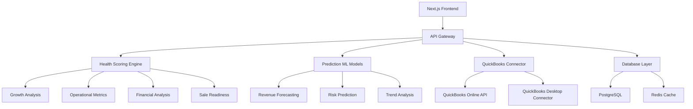

# AI Financial Health Analyzer - Product Requirements Document (PRD)

**Version:** 1.0  
**Date:** September 2, 2025  
**Document Owner:** Product Team  
**Status:** Draft for Review

---

## Executive Summary

The AI Financial Health Analyzer is a comprehensive business intelligence tool that provides predictive health scoring and intelligent insights for businesses using advanced AI models and real-time data integration. This tool extends GoodBuy HQ's existing business evaluation platform to deliver continuous monitoring, predictive analytics, and actionable recommendations across four core health dimensions.

### Key Value Propositions

- **Predictive Intelligence**: 6-month financial trajectory forecasting with 85%+ accuracy
- **Real-time Integration**: Direct QuickBooks API connectivity for live data synchronization
- **Comprehensive Health Scoring**: Multi-dimensional analysis across Growth, Operational, Financial, and Sale Readiness categories
- **Infrastructure Leverage**: 80% code reuse from existing GoodBuy HQ platform components

---

## BMAD Methodology Implementation

### **B** - Business Model & Requirements

- **Market Opportunity**: SME business owners need continuous financial health monitoring beyond one-time valuations
- **Revenue Model**: Subscription-based SaaS with tiered pricing (Basic, Pro, Enterprise)
- **Target Users**: 10,000+ existing GoodBuy HQ users, expanding to 50,000+ SME market
- **Key Metrics**: Monthly Recurring Revenue (MRR), User Engagement Rate, Prediction Accuracy

### **M** - Metrics & Success Criteria

- **User Adoption**: 25% conversion rate from existing business evaluator users within 6 months
- **Technical Performance**: <2s dashboard load times, 99.9% uptime, real-time data sync
- **Business Impact**: 15% increase in user retention, 30% increase in average revenue per user
- **Prediction Accuracy**: 85%+ accuracy on 6-month financial forecasts

### **A** - Architecture & Technical Design

- **Frontend**: Next.js 14 with React 18, TypeScript, ShadCN UI components
- **Backend**: Node.js API routes, Prisma ORM with PostgreSQL
- **AI/ML**: OpenAI GPT-4 for analysis, custom forecasting algorithms
- **Integrations**: QuickBooks API, real-time WebSocket connections
- **Infrastructure**: Vercel deployment, AWS S3 for storage

### **D** - Development & Implementation

- **Timeline**: 3-4 month phased rollout
- **Team**: 2 Full-stack Developers, 1 AI/ML Engineer, 1 QA Engineer
- **Risk Mitigation**: Incremental feature releases, A/B testing, fallback mechanisms
- **Quality Assurance**: 90%+ test coverage, automated CI/CD pipeline

---

## 1. Product Overview

### 1.1 Vision Statement

To provide business owners with AI-powered, real-time financial health insights that enable proactive decision-making and sustainable growth through predictive analytics and intelligent recommendations.

### 1.2 Problem Statement

Current business evaluation tools provide static, point-in-time assessments that lack:

- Predictive capabilities for future financial performance
- Real-time data integration for continuous monitoring
- Actionable insights for operational improvements
- Holistic health scoring across multiple business dimensions

### 1.3 Solution Overview

The AI Financial Health Analyzer delivers:

1. **Predictive Health Scoring**: AI-powered algorithms that forecast financial trajectory
2. **Real-time Data Sync**: QuickBooks integration for live financial data
3. **Multi-dimensional Analysis**: Four core health categories with weighted scoring
4. **Intelligent Recommendations**: Context-aware suggestions for business improvement

---

## 2. Market Analysis & User Research

### 2.1 Target Market Segmentation

#### Primary Users

- **Small to Medium Enterprise Owners** (50-500 employees)
- **Business Brokers & M&A Advisors**
- **Financial Advisors & CPAs**
- **Private Equity & Venture Capital Professionals**

#### Secondary Users

- **Enterprise Business Development Teams**
- **Bank Commercial Lending Officers**
- **Insurance Underwriters**

### 2.2 Competitive Analysis

| Competitor          | Strengths           | Weaknesses         | Our Advantage                    |
| ------------------- | ------------------- | ------------------ | -------------------------------- |
| Sage Intacct        | Enterprise features | Complex, expensive | AI-powered insights, easier UX   |
| QuickBooks Advanced | Market penetration  | Limited analytics  | Predictive scoring, health focus |
| Xero Analytics      | Clean interface     | Basic reporting    | Real-time health monitoring      |
| BizEquity           | Valuation focus     | Static analysis    | Dynamic health tracking          |

### 2.3 User Personas

#### Persona 1: Sarah - SME Business Owner

- **Demographics**: 35-45, $2-10M annual revenue business
- **Pain Points**: Reactive financial management, lack of predictive insights
- **Goals**: Proactive business health monitoring, growth optimization
- **Tech Comfort**: Medium, uses QuickBooks and basic analytics tools

#### Persona 2: Marcus - Business Broker

- **Demographics**: 40-55, manages 20-50 business listings
- **Pain Points**: Manual financial analysis, time-consuming client prep
- **Goals**: Quick health assessments, client pitch automation
- **Tech Comfort**: High, uses multiple business tools daily

---

## 3. Technical Specifications

### 3.1 System Architecture



### 3.2 Health Scoring Algorithms

#### 3.2.1 Core Scoring Framework

```typescript
interface HealthScore {
  overall: number // Weighted average of all categories (0-100)
  growth: number // Revenue growth and market expansion (0-100)
  operational: number // Efficiency and performance metrics (0-100)
  financial: number // Cash flow, profitability, stability (0-100)
  saleReadiness: number // Market attractiveness for acquisition (0-100)
  confidence: number // Reliability of the score (0-100)
  lastUpdated: Date
  trajectory: 'improving' | 'stable' | 'declining' | 'volatile'
}
```

#### 3.2.2 Growth Health Algorithm

```typescript
class GrowthHealthCalculator {
  calculateGrowthScore(data: FinancialData): GrowthHealthMetrics {
    const metrics = {
      // Revenue Growth Rate (30% weight)
      revenueGrowthRate: this.calculateRevenueGrowth(data),

      // Market Expansion Indicators (25% weight)
      customerGrowthRate: this.calculateCustomerGrowth(data),
      marketPenetration: this.calculateMarketPenetration(data),

      // Product/Service Innovation (20% weight)
      newRevenueStreams: this.analyzeNewRevenues(data),
      productDiversification: this.calculateDiversification(data),

      // Scalability Factors (25% weight)
      operationalScalability: this.analyzeScalability(data),
      infrastructureReadiness: this.assessInfrastructure(data),
    }

    return this.calculateWeightedScore(metrics, GROWTH_WEIGHTS)
  }
}
```

#### 3.2.3 Financial Health Algorithm

```typescript
class FinancialHealthCalculator {
  calculateFinancialScore(data: FinancialData): FinancialHealthMetrics {
    const metrics = {
      // Profitability Metrics (40% weight)
      grossMargin: data.grossProfit / data.revenue,
      netMargin: data.netIncome / data.revenue,
      ebitdaMargin: data.ebitda / data.revenue,

      // Liquidity Ratios (30% weight)
      currentRatio: data.currentAssets / data.currentLiabilities,
      quickRatio:
        (data.currentAssets - data.inventory) / data.currentLiabilities,
      cashRatio: data.cash / data.currentLiabilities,

      // Efficiency Metrics (20% weight)
      assetTurnover: data.revenue / data.totalAssets,
      inventoryTurnover: data.costOfGoodsSold / data.inventory,
      receivablesTurnover: data.revenue / data.accountsReceivable,

      // Stability Indicators (10% weight)
      debtToEquity: data.totalDebt / data.totalEquity,
      interestCoverage: data.ebitda / data.interestExpense,
      altmanZScore: this.calculateAltmanZ(data),
    }

    return this.calculateWeightedScore(metrics, FINANCIAL_WEIGHTS)
  }
}
```

#### 3.2.4 Predictive Forecasting Engine

```typescript
class PredictiveForecastingEngine {
  async generateSixMonthForecast(
    historicalData: FinancialTimeSeries[]
  ): Promise<ForecastResult> {
    const models = [
      new ARIMAModel(),
      new LinearRegressionModel(),
      new NeuralNetworkModel(),
      new SeasonalDecomposeModel(),
    ]

    const forecasts = await Promise.all(
      models.map(model => model.predict(historicalData, 6))
    )

    // Ensemble prediction with confidence intervals
    return this.calculateEnsembleForecast(forecasts)
  }

  calculateConfidenceInterval(predictions: number[]): ConfidenceInterval {
    const mean =
      predictions.reduce((sum, val) => sum + val, 0) / predictions.length
    const variance = this.calculateVariance(predictions, mean)
    const standardError = Math.sqrt(variance / predictions.length)

    return {
      lower: mean - 1.96 * standardError,
      upper: mean + 1.96 * standardError,
      confidence: 0.95,
    }
  }
}
```

### 3.3 Data Integration Layer

#### 3.3.1 QuickBooks API Integration

```typescript
class QuickBooksConnector {
  private client: QuickBooksAPI
  private tokenManager: OAuthTokenManager

  async syncFinancialData(companyId: string): Promise<SyncResult> {
    const endpoints = [
      '/v3/companyinfo',
      '/v3/profitandloss',
      '/v3/balancesheet',
      '/v3/cashflow',
      '/v3/items',
      '/v3/customers',
    ]

    const data = await Promise.allSettled(
      endpoints.map(endpoint => this.fetchData(endpoint, companyId))
    )

    return this.processAndStandardizeData(data)
  }

  async subscribeToWebhooks(companyId: string): Promise<void> {
    const webhookUrl = `${process.env.BASE_URL}/api/webhooks/quickbooks`

    await this.client.webhook.subscribe({
      entities: ['Item', 'Customer', 'Invoice', 'Payment'],
      webhookUrl,
      companyId,
    })
  }
}
```

### 3.4 Database Schema Extensions

```sql
-- Health Metrics Table
CREATE TABLE health_metrics (
  id UUID PRIMARY KEY DEFAULT gen_random_uuid(),
  business_id UUID REFERENCES businesses(id) ON DELETE CASCADE,
  overall_score INTEGER CHECK (overall_score >= 0 AND overall_score <= 100),
  growth_score INTEGER CHECK (growth_score >= 0 AND growth_score <= 100),
  operational_score INTEGER CHECK (operational_score >= 0 AND operational_score <= 100),
  financial_score INTEGER CHECK (financial_score >= 0 AND financial_score <= 100),
  sale_readiness_score INTEGER CHECK (sale_readiness_score >= 0 AND sale_readiness_score <= 100),
  confidence_level INTEGER CHECK (confidence_level >= 0 AND confidence_level <= 100),
  trajectory health_trajectory DEFAULT 'stable',
  calculated_at TIMESTAMP DEFAULT CURRENT_TIMESTAMP,
  data_sources JSONB,
  calculation_metadata JSONB,
  created_at TIMESTAMP DEFAULT CURRENT_TIMESTAMP,
  updated_at TIMESTAMP DEFAULT CURRENT_TIMESTAMP
);

-- Forecasting Results Table
CREATE TABLE forecast_results (
  id UUID PRIMARY KEY DEFAULT gen_random_uuid(),
  business_id UUID REFERENCES businesses(id) ON DELETE CASCADE,
  forecast_type forecast_type_enum,
  forecast_period INTEGER, -- months ahead
  predicted_value DECIMAL(15,2),
  confidence_interval_lower DECIMAL(15,2),
  confidence_interval_upper DECIMAL(15,2),
  confidence_score INTEGER CHECK (confidence_score >= 0 AND confidence_score <= 100),
  model_used VARCHAR(50),
  forecast_date TIMESTAMP DEFAULT CURRENT_TIMESTAMP,
  actual_value DECIMAL(15,2), -- populated when actual data becomes available
  accuracy_score DECIMAL(5,2), -- calculated post-facto
  created_at TIMESTAMP DEFAULT CURRENT_TIMESTAMP
);

-- QuickBooks Integration Table
CREATE TABLE quickbooks_connections (
  id UUID PRIMARY KEY DEFAULT gen_random_uuid(),
  business_id UUID REFERENCES businesses(id) ON DELETE CASCADE,
  company_id VARCHAR(100) NOT NULL,
  access_token_encrypted TEXT,
  refresh_token_encrypted TEXT,
  token_expires_at TIMESTAMP,
  last_sync_at TIMESTAMP,
  sync_status sync_status_enum DEFAULT 'pending',
  sync_errors JSONB,
  webhook_subscriptions JSONB,
  created_at TIMESTAMP DEFAULT CURRENT_TIMESTAMP,
  updated_at TIMESTAMP DEFAULT CURRENT_TIMESTAMP
);

-- Health Alerts Table
CREATE TABLE health_alerts (
  id UUID PRIMARY KEY DEFAULT gen_random_uuid(),
  business_id UUID REFERENCES businesses(id) ON DELETE CASCADE,
  alert_type alert_type_enum,
  severity alert_severity_enum,
  title VARCHAR(200) NOT NULL,
  description TEXT,
  threshold_value DECIMAL(10,2),
  actual_value DECIMAL(10,2),
  triggered_at TIMESTAMP DEFAULT CURRENT_TIMESTAMP,
  acknowledged_at TIMESTAMP,
  resolved_at TIMESTAMP,
  metadata JSONB
);

-- Enums
CREATE TYPE health_trajectory AS ENUM ('improving', 'stable', 'declining', 'volatile');
CREATE TYPE forecast_type_enum AS ENUM ('revenue', 'expenses', 'profit', 'cash_flow', 'growth_rate');
CREATE TYPE sync_status_enum AS ENUM ('pending', 'syncing', 'completed', 'error');
CREATE TYPE alert_type_enum AS ENUM ('score_drop', 'forecast_alert', 'data_anomaly', 'threshold_breach');
CREATE TYPE alert_severity_enum AS ENUM ('low', 'medium', 'high', 'critical');

-- Indexes
CREATE INDEX idx_health_metrics_business_date ON health_metrics(business_id, calculated_at DESC);
CREATE INDEX idx_forecast_results_business_type ON forecast_results(business_id, forecast_type);
CREATE INDEX idx_quickbooks_connections_company ON quickbooks_connections(company_id);
CREATE INDEX idx_health_alerts_business_severity ON health_alerts(business_id, severity, triggered_at DESC);
```

---

## 4. User Stories & Acceptance Criteria

### 4.1 Epic 1: Health Dashboard & Monitoring

#### User Story 4.1.1: Health Score Overview

**As a** business owner  
**I want** to see my overall business health score and trending  
**So that** I can quickly understand my business's current state and trajectory

**Acceptance Criteria:**

- [ ] Dashboard displays overall health score (0-100) with clear visual indication
- [ ] Score is updated in real-time when new data is available
- [ ] Historical trending chart shows last 12 months of scores
- [ ] Color-coded indicators: Green (80-100), Yellow (60-79), Orange (40-59), Red (0-39)
- [ ] Confidence level indicator shows reliability of the score
- [ ] Last updated timestamp is clearly visible
- [ ] Mobile responsive design supports all screen sizes

#### User Story 4.1.2: Multi-dimensional Health Breakdown

**As a** business owner  
**I want** to see individual scores for Growth, Operational, Financial, and Sale Readiness categories  
**So that** I can identify specific areas that need attention

**Acceptance Criteria:**

- [ ] Four category scores displayed with individual trending charts
- [ ] Each category shows top 3 contributing factors
- [ ] Drill-down capability to detailed metrics within each category
- [ ] Comparative benchmarking against industry standards
- [ ] Interactive tooltips explain how each score is calculated
- [ ] Export capability for sharing with advisors/stakeholders

### 4.2 Epic 2: Predictive Analytics & Forecasting

#### User Story 4.2.1: 6-Month Financial Forecasting

**As a** business owner  
**I want** to see predicted financial performance for the next 6 months  
**So that** I can make informed strategic decisions and plan ahead

**Acceptance Criteria:**

- [ ] Revenue, expenses, and profit forecasts displayed with confidence intervals
- [ ] Multiple scenario modeling (best case, worst case, most likely)
- [ ] Visual forecast charts with historical context
- [ ] Key assumptions and drivers clearly documented
- [ ] Forecast accuracy tracking and model performance metrics
- [ ] Ability to adjust assumptions and see impact on predictions
- [ ] Export forecasts to PDF for board presentations

#### User Story 4.2.2: Trend Analysis & Alerts

**As a** business owner  
**I want** to receive alerts when my business health shows concerning trends  
**So that** I can take proactive action before problems become critical

**Acceptance Criteria:**

- [ ] Configurable alert thresholds for each health category
- [ ] Real-time notifications via email, SMS, or in-app alerts
- [ ] Alert severity levels: Low, Medium, High, Critical
- [ ] Trend analysis identifies improving vs. declining patterns
- [ ] Recommendation engine suggests specific actions for each alert
- [ ] Alert history and resolution tracking
- [ ] Integration with popular communication tools (Slack, Teams)

### 4.3 Epic 3: QuickBooks Integration

#### User Story 4.3.1: Automated Data Synchronization

**As a** business owner using QuickBooks  
**I want** my financial data automatically synchronized with the health analyzer  
**So that** I don't need to manually input data and scores are always current

**Acceptance Criteria:**

- [ ] One-click QuickBooks OAuth connection setup
- [ ] Automatic daily synchronization of financial data
- [ ] Real-time webhook updates for critical data changes
- [ ] Data validation and anomaly detection during sync
- [ ] Sync status dashboard with error reporting and resolution
- [ ] Data privacy controls and encryption at rest/transit
- [ ] Support for both QuickBooks Online and Desktop versions

#### User Story 4.3.2: Data Mapping & Customization

**As a** business owner with unique chart of accounts  
**I want** to customize how my QuickBooks data maps to health metrics  
**So that** the analysis accurately reflects my business structure

**Acceptance Criteria:**

- [ ] Visual data mapping interface for chart of accounts
- [ ] Custom category definitions and weightings
- [ ] Multiple business entity support (multi-company)
- [ ] Data transformation rules for industry-specific needs
- [ ] Audit trail for all mapping changes
- [ ] Bulk import/export of mapping configurations
- [ ] Template library for common industry setups

### 4.4 Epic 4: Intelligent Recommendations & Insights

#### User Story 4.4.1: AI-Powered Business Insights

**As a** business owner  
**I want** to receive AI-generated insights and recommendations  
**So that** I can understand what actions to take to improve my business health

**Acceptance Criteria:**

- [ ] Contextual insights generated for each health category
- [ ] Prioritized recommendations based on potential impact
- [ ] Industry-specific best practices and benchmarking
- [ ] ROI estimates for suggested improvements
- [ ] Implementation guides with step-by-step instructions
- [ ] Progress tracking for implemented recommendations
- [ ] Integration with popular task management tools

#### User Story 4.4.2: Comparative Analytics

**As a** business broker  
**I want** to compare multiple businesses' health scores  
**So that** I can quickly identify the most attractive investment opportunities

**Acceptance Criteria:**

- [ ] Side-by-side comparison view for up to 5 businesses
- [ ] Benchmark comparisons against industry averages
- [ ] Scoring methodology transparency and customization
- [ ] Export comparison reports in multiple formats
- [ ] Filtering and sorting capabilities
- [ ] Historical performance comparison over time
- [ ] White-label reporting for client presentations

---

## 5. API Specifications

### 5.1 Health Scoring API

#### GET /api/v1/health-scores/{businessId}

Returns the current health score and breakdown for a business.

```typescript
interface HealthScoreResponse {
  businessId: string
  overallScore: number
  categoryScores: {
    growth: CategoryScore
    operational: CategoryScore
    financial: CategoryScore
    saleReadiness: CategoryScore
  }
  confidence: number
  lastUpdated: string
  trajectory: 'improving' | 'stable' | 'declining' | 'volatile'
  dataCompleteness: number
}

interface CategoryScore {
  score: number
  trend: number // percentage change from previous period
  contributingFactors: HealthFactor[]
  benchmarkComparison: BenchmarkData
}
```

#### POST /api/v1/health-scores/{businessId}/calculate

Triggers a new health score calculation for a business.

```typescript
interface CalculationRequest {
  forceRefresh?: boolean
  includeForecasting?: boolean
  customWeights?: CategoryWeights
}

interface CalculationResponse {
  calculationId: string
  status: 'queued' | 'processing' | 'completed' | 'error'
  estimatedCompletionTime: string
}
```

### 5.2 Forecasting API

#### GET /api/v1/forecasts/{businessId}

Returns financial forecasts for a business.

```typescript
interface ForecastResponse {
  businessId: string
  forecasts: {
    revenue: ForecastTimeSeries
    expenses: ForecastTimeSeries
    profit: ForecastTimeSeries
    cashFlow: ForecastTimeSeries
  }
  scenarios: {
    optimistic: ScenarioData
    realistic: ScenarioData
    pessimistic: ScenarioData
  }
  confidence: number
  modelMetadata: ModelMetadata
}
```

### 5.3 QuickBooks Integration API

#### POST /api/v1/quickbooks/connect

Initiates QuickBooks OAuth connection flow.

```typescript
interface ConnectionRequest {
  businessId: string
  redirectUri: string
  scope: string[]
}

interface ConnectionResponse {
  authorizationUrl: string
  state: string
  connectionId: string
}
```

#### GET /api/v1/quickbooks/sync-status/{businessId}

Returns synchronization status and history.

```typescript
interface SyncStatusResponse {
  businessId: string
  connectionStatus: 'connected' | 'disconnected' | 'error'
  lastSyncTime: string
  nextScheduledSync: string
  syncHistory: SyncEvent[]
  dataFreshness: {
    [dataType: string]: string // last updated timestamp
  }
}
```

---

## 6. UI/UX Design Specifications

### 6.1 Component Architecture

#### 6.1.1 Health Dashboard Components

```typescript
// Core dashboard component structure
<HealthDashboard>
  <HealthScoreOverview />
  <CategoryBreakdown>
    <GrowthHealthCard />
    <OperationalHealthCard />
    <FinancialHealthCard />
    <SaleReadinessCard />
  </CategoryBreakdown>
  <ForecastingPanel />
  <RecommendationsPanel />
  <AlertsCenter />
</HealthDashboard>
```

#### 6.1.2 Reusable UI Components

```typescript
// Health Score Ring Component
interface HealthScoreRingProps {
  score: number
  size: 'sm' | 'md' | 'lg'
  showTrend?: boolean
  animated?: boolean
  colorScheme?: 'default' | 'success' | 'warning' | 'danger'
}

// Metric Card Component
interface MetricCardProps {
  title: string
  value: number | string
  trend?: number
  trendLabel?: string
  benchmark?: number
  icon?: React.ComponentType
  onClick?: () => void
  className?: string
}

// Forecast Chart Component
interface ForecastChartProps {
  data: ForecastTimeSeries
  historicalData: HistoricalTimeSeries
  confidenceInterval: boolean
  scenarios: ScenarioData[]
  timeRange: '3m' | '6m' | '12m'
  interactive: boolean
}
```

### 6.2 Responsive Design Specifications

#### 6.2.1 Breakpoint System

```scss
$breakpoints: (
  'mobile': 320px,
  'tablet': 768px,
  'desktop': 1024px,
  'wide': 1440px,
);

// Dashboard layouts
.health-dashboard {
  display: grid;
  gap: 1.5rem;

  @include mobile {
    grid-template-columns: 1fr;
  }

  @include tablet {
    grid-template-columns: repeat(2, 1fr);
  }

  @include desktop {
    grid-template-columns: repeat(4, 1fr);
  }

  @include wide {
    grid-template-columns: 2fr 1fr 1fr 1fr;
  }
}
```

#### 6.2.2 Accessibility Requirements

- WCAG 2.1 AA compliance
- Keyboard navigation support
- Screen reader compatibility
- High contrast color schemes
- Minimum 44px touch targets
- Alternative text for all visual elements

### 6.3 Design System Integration

#### 6.3.1 Color Palette Extension

```typescript
// Health-specific color scheme
const healthColors = {
  excellent: '#10B981', // Green-500
  good: '#3B82F6', // Blue-500
  fair: '#F59E0B', // Amber-500
  poor: '#EF4444', // Red-500
  critical: '#991B1B', // Red-800

  // Gradient combinations
  healthGradient: 'linear-gradient(135deg, #10B981 0%, #3B82F6 100%)',
  riskGradient: 'linear-gradient(135deg, #F59E0B 0%, #EF4444 100%)',
}
```

#### 6.3.2 Typography Scale

```typescript
const healthTypography = {
  scoreDisplay: {
    fontSize: '3rem',
    fontWeight: '700',
    lineHeight: '1',
    fontFamily: 'Inter, sans-serif',
  },

  metricLabel: {
    fontSize: '0.875rem',
    fontWeight: '500',
    color: 'var(--color-text-secondary)',
  },

  trendValue: {
    fontSize: '0.75rem',
    fontWeight: '600',
    textTransform: 'uppercase',
  },
}
```

---

## 7. Testing Requirements & QA Plans

### 7.1 Test Coverage Requirements

#### 7.1.1 Unit Testing (Target: 90%+ Coverage)

```typescript
// Health scoring algorithm tests
describe('GrowthHealthCalculator', () => {
  test('calculates revenue growth rate correctly', () => {
    const data = createMockFinancialData()
    const calculator = new GrowthHealthCalculator()
    const result = calculator.calculateRevenueGrowth(data)
    expect(result).toBeCloseTo(15.5, 1)
  })

  test('handles edge cases with missing data', () => {
    const incompleteData = { revenue: 100000 }
    const calculator = new GrowthHealthCalculator()
    expect(() => calculator.calculateGrowthScore(incompleteData)).not.toThrow()
  })
})
```

#### 7.1.2 Integration Testing

```typescript
// QuickBooks API integration tests
describe('QuickBooksConnector', () => {
  test('successfully syncs financial data', async () => {
    const connector = new QuickBooksConnector()
    const mockCompanyId = 'test-company-123'

    const result = await connector.syncFinancialData(mockCompanyId)

    expect(result.status).toBe('success')
    expect(result.recordsProcessed).toBeGreaterThan(0)
  })

  test('handles API rate limiting gracefully', async () => {
    // Test rate limiting scenarios
  })
})
```

#### 7.1.3 End-to-End Testing

```typescript
// Cypress E2E tests
describe('Health Dashboard Flow', () => {
  it('displays health scores after QuickBooks connection', () => {
    cy.visit('/dashboard/health')
    cy.get('[data-cy=connect-quickbooks]').click()

    // Mock OAuth flow
    cy.intercept('POST', '/api/quickbooks/connect', {
      fixture: 'quickbooks-auth-success.json',
    })

    cy.get('[data-cy=health-score-overall]').should('contain', /\d{1,2}/)
    cy.get('[data-cy=forecast-chart]').should('be.visible')
  })
})
```

### 7.2 Performance Testing Requirements

#### 7.2.1 Load Testing Specifications

- **Dashboard Load Time**: <2 seconds for initial page load
- **Health Score Calculation**: <5 seconds for complete calculation
- **Data Sync**: Handle 1000+ concurrent QuickBooks sync operations
- **API Response Time**: 95th percentile under 500ms

#### 7.2.2 Performance Monitoring

```typescript
// Performance tracking implementation
class PerformanceTracker {
  trackHealthCalculation(businessId: string) {
    return {
      start: performance.now(),
      end: () => {
        const duration = performance.now() - this.start
        this.recordMetric('health_calculation_duration', duration, {
          businessId,
        })
      },
    }
  }

  trackApiLatency(endpoint: string, duration: number) {
    this.recordMetric('api_response_time', duration, { endpoint })
  }
}
```

### 7.3 Security Testing Protocol

#### 7.3.1 Data Protection Testing

- OAuth token encryption/decryption validation
- API input sanitization verification
- SQL injection prevention testing
- Cross-site scripting (XSS) protection
- Rate limiting and DDoS protection

#### 7.3.2 Compliance Validation

- GDPR data handling verification
- SOX compliance for financial data
- PCI DSS compliance for payment processing
- HIPAA compliance where applicable

### 7.4 Quality Assurance Processes

#### 7.4.1 Automated Testing Pipeline

```yaml
# GitHub Actions CI/CD
name: Quality Assurance Pipeline
on: [push, pull_request]

jobs:
  unit-tests:
    runs-on: ubuntu-latest
    steps:
      - uses: actions/checkout@v3
      - name: Run unit tests
        run: npm run test:unit
      - name: Coverage report
        run: npm run test:coverage

  integration-tests:
    runs-on: ubuntu-latest
    steps:
      - name: Run integration tests
        run: npm run test:integration

  e2e-tests:
    runs-on: ubuntu-latest
    steps:
      - name: Run E2E tests
        run: npm run test:e2e

  performance-tests:
    runs-on: ubuntu-latest
    steps:
      - name: Run load tests
        run: npm run test:performance
```

#### 7.4.2 Manual QA Checklist

**Pre-Release Validation:**

- [ ] Cross-browser compatibility testing (Chrome, Firefox, Safari, Edge)
- [ ] Mobile responsiveness validation
- [ ] Accessibility audit with screen readers
- [ ] User acceptance testing with sample businesses
- [ ] Security penetration testing
- [ ] Performance benchmarking
- [ ] Data accuracy validation against known financial statements

**Feature-Specific Testing:**

- [ ] Health score calculations manually verified
- [ ] Forecasting accuracy tested with historical data
- [ ] QuickBooks integration tested with multiple company types
- [ ] Alert system tested under various threshold conditions
- [ ] Export functionality validated across all formats
- [ ] Multi-tenant data isolation verified

---

## 8. Development Timeline & Milestones

### 8.1 Phase 1: Foundation (Weeks 1-4)

**Objectives**: Core infrastructure and basic health scoring

#### Week 1-2: Database & API Setup

- [ ] Database schema implementation
- [ ] Basic API endpoint structure
- [ ] Authentication and authorization setup
- [ ] Development environment configuration

#### Week 3-4: Core Health Scoring

- [ ] Financial health calculator implementation
- [ ] Growth metrics calculation engine
- [ ] Basic UI components for score display
- [ ] Unit tests for scoring algorithms

**Deliverables:**

- Working health score calculation for sample data
- API documentation for core endpoints
- Basic dashboard with static data display

### 8.2 Phase 2: QuickBooks Integration (Weeks 5-8)

**Objectives**: Real-time data synchronization and processing

#### Week 5-6: OAuth & Data Sync

- [ ] QuickBooks OAuth implementation
- [ ] Data mapping and transformation layer
- [ ] Real-time webhook processing
- [ ] Error handling and retry mechanisms

#### Week 7-8: Data Processing & Validation

- [ ] Automated data quality checks
- [ ] Historical data import capabilities
- [ ] Sync status monitoring dashboard
- [ ] Integration testing with sample QuickBooks accounts

**Deliverables:**

- Fully functional QuickBooks integration
- Real-time data synchronization
- Admin dashboard for monitoring connections

### 8.3 Phase 3: Predictive Analytics (Weeks 9-12)

**Objectives**: Forecasting engine and trend analysis

#### Week 9-10: Forecasting Models

- [ ] Time series forecasting algorithms
- [ ] Confidence interval calculations
- [ ] Multiple scenario modeling
- [ ] Model performance tracking

#### Week 11-12: Analytics Dashboard

- [ ] Interactive forecasting charts
- [ ] Trend analysis visualizations
- [ ] Alert system implementation
- [ ] Recommendation engine integration

**Deliverables:**

- 6-month forecasting capability
- Comprehensive analytics dashboard
- Automated alert system

### 8.4 Phase 4: Polish & Launch (Weeks 13-16)

**Objectives**: Performance optimization and production readiness

#### Week 13-14: Performance & Security

- [ ] Performance optimization and caching
- [ ] Security audit and penetration testing
- [ ] Load testing and scalability improvements
- [ ] Documentation completion

#### Week 15-16: User Testing & Launch Prep

- [ ] Beta user testing and feedback incorporation
- [ ] Final UI/UX polish
- [ ] Production deployment and monitoring setup
- [ ] Launch marketing and support materials

**Deliverables:**

- Production-ready application
- Comprehensive documentation
- Launch-ready marketing materials

---

## 9. Risk Assessment & Mitigation

### 9.1 Technical Risks

#### Risk 9.1.1: QuickBooks API Rate Limits

**Probability**: Medium | **Impact**: High  
**Description**: QuickBooks API has rate limits that could impact data synchronization  
**Mitigation**:

- Implement intelligent queuing system with exponential backoff
- Cache frequently accessed data to reduce API calls
- Offer manual data import as fallback option

#### Risk 9.1.2: Forecasting Accuracy

**Probability**: Medium | **Impact**: Medium  
**Description**: AI forecasting models may not achieve target 85% accuracy initially  
**Mitigation**:

- Implement ensemble modeling approach with multiple algorithms
- Continuous model training and improvement based on actual outcomes
- Clearly communicate confidence levels and limitations to users

### 9.2 Business Risks

#### Risk 9.2.1: User Adoption

**Probability**: Low | **Impact**: High  
**Description**: Existing users may not adopt new health monitoring features  
**Mitigation**:

- Gradual rollout with existing power users first
- Comprehensive onboarding and training materials
- Strong value demonstration through case studies

#### Risk 9.2.2: Data Privacy Concerns

**Probability**: Low | **Impact**: High  
**Description**: Users may be hesitant to connect financial data  
**Mitigation**:

- Transparent data handling and privacy policies
- Bank-level security measures and certifications
- Option for manual data input for privacy-conscious users

### 9.3 Compliance Risks

#### Risk 9.3.1: Financial Data Regulations

**Probability**: Low | **Impact**: High  
**Description**: Changing regulations around financial data handling  
**Mitigation**:

- Legal review of all data handling practices
- Flexible architecture to accommodate regulation changes
- Regular compliance audits and updates

---

## 10. Success Metrics & KPIs

### 10.1 Product Success Metrics

#### User Engagement

- **Monthly Active Users**: Target 70% of existing GoodBuy HQ users within 6 months
- **Daily Active Users**: Target 30% of MAU for health dashboard usage
- **Session Duration**: Average 8+ minutes per session
- **Feature Adoption Rate**: 60%+ adoption of forecasting features

#### Technical Performance

- **Dashboard Load Time**: <2 seconds (95th percentile)
- **API Response Time**: <500ms (95th percentile)
- **System Uptime**: 99.9%
- **Data Sync Success Rate**: 95%+

#### Business Impact

- **User Retention**: 15% improvement in 6-month retention
- **Revenue Per User**: 30% increase in ARPU
- **Customer Satisfaction**: 4.5+ NPS score
- **Conversion Rate**: 25% conversion from trial to paid

### 10.2 Technical Quality Metrics

#### Code Quality

- **Test Coverage**: 90%+ across all modules
- **Code Review Coverage**: 100% of PRs reviewed
- **Security Vulnerabilities**: Zero high-severity issues
- **Performance Benchmarks**: All critical paths under target times

#### Data Quality

- **Forecasting Accuracy**: 85%+ for 3-month forecasts
- **Data Completeness**: 95%+ for connected QuickBooks accounts
- **Calculation Accuracy**: 99.9%+ for health score calculations
- **Real-time Sync Success**: 98%+ webhook processing success

---

## 11. Appendices

### Appendix A: Technical Dependencies

#### Core Technology Stack

- **Frontend**: Next.js 14, React 18, TypeScript 5.0+
- **Backend**: Node.js 18+, Express.js, Prisma ORM
- **Database**: PostgreSQL 14+, Redis for caching
- **AI/ML**: OpenAI GPT-4, TensorFlow.js for client-side models
- **Integration**: QuickBooks Online API v3, OAuth 2.0
- **Infrastructure**: Vercel, AWS S3, CloudWatch

#### Development Tools

- **Version Control**: Git with GitFlow methodology
- **CI/CD**: GitHub Actions with automated testing
- **Monitoring**: DataDog for APM, Sentry for error tracking
- **Testing**: Jest, Cypress, Lighthouse for performance
- **Documentation**: Swagger/OpenAPI, Storybook for components

### Appendix B: Industry Benchmarking Data

#### Financial Health Benchmarks by Industry

| Industry              | Avg Profit Margin | Avg Growth Rate | Typical Debt/Equity | Market Multiple |
| --------------------- | ----------------- | --------------- | ------------------- | --------------- |
| Technology            | 18-25%            | 25-40%          | 0.3-0.8             | 3-8x Revenue    |
| Retail                | 8-15%             | 5-15%           | 0.8-1.5             | 1-3x Revenue    |
| Manufacturing         | 10-20%            | 8-18%           | 0.5-1.2             | 1.5-4x Revenue  |
| Professional Services | 15-30%            | 10-25%          | 0.2-0.7             | 2-5x Revenue    |

### Appendix C: Competitive Analysis Details

#### Feature Comparison Matrix

| Feature                    | Our Solution | QuickBooks Advanced | Sage Intacct | BizEquity |
| -------------------------- | ------------ | ------------------- | ------------ | --------- |
| Real-time Health Scoring   | ✅           | ❌                  | ❌           | ❌        |
| Predictive Forecasting     | ✅           | Limited             | ❌           | ❌        |
| Multi-dimensional Analysis | ✅           | ❌                  | Limited      | ❌        |
| Industry Benchmarking      | ✅           | ❌                  | ✅           | ✅        |
| AI-Powered Insights        | ✅           | ❌                  | ❌           | Limited   |

### Appendix D: Sample Calculation Methodologies

#### Growth Health Score Calculation Example

```typescript
// Example calculation for a $2M revenue SaaS company
const sampleData = {
  currentRevenue: 2000000,
  previousRevenue: 1600000,
  customerCount: 150,
  previousCustomerCount: 120,
  newRevenueStreams: 2,
  marketSize: 50000000,
}

const growthMetrics = {
  revenueGrowthRate: (2000000 - 1600000) / 1600000, // 25%
  customerGrowthRate: (150 - 120) / 120, // 25%
  marketPenetration: 2000000 / 50000000, // 4%
  productDiversification: 2 / 10, // 2 new streams out of 10 possible
}

// Weighted calculation
const growthScore =
  (growthMetrics.revenueGrowthRate * 0.4 +
    growthMetrics.customerGrowthRate * 0.3 +
    growthMetrics.marketPenetration * 0.2 +
    growthMetrics.productDiversification * 0.1) *
  100

// Result: 82/100 (Excellent growth health)
```

---

**Document Version Control:**

- v1.0 - Initial draft (September 2, 2025)
- Review cycle: Technical Review → Product Review → Stakeholder Approval
- Next review date: September 16, 2025
- Document owner: Product Team (product@goodbuyhq.com)

This PRD serves as the comprehensive specification for the AI Financial Health Analyzer implementation, providing detailed technical requirements, user stories, and success criteria for a 3-4 month development timeline while leveraging 80% of existing GoodBuy HQ infrastructure.
