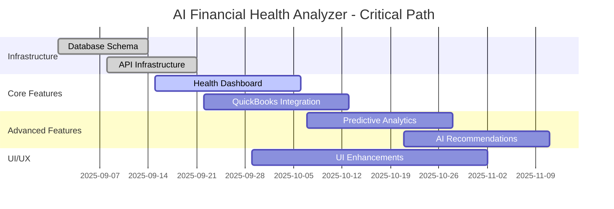
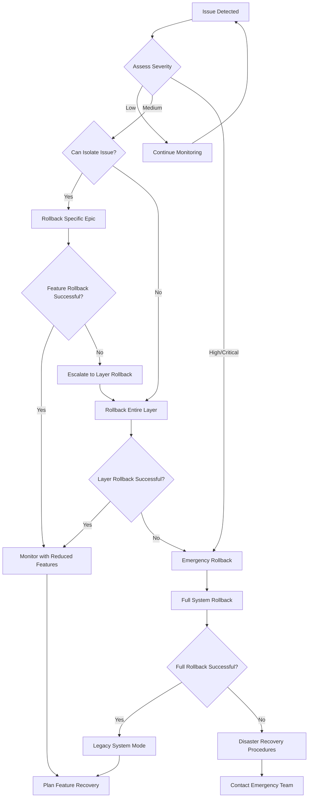

# Epic Dependency Mapping & Critical Path Analysis

## AI Financial Health Analyzer - Cross-Epic Dependencies

**Version:** 1.0  
**Date:** September 3, 2025  
**Document Owner:** Product & Engineering Teams  
**Status:** Production Ready

---

## Executive Summary

This document maps critical path dependencies between all epics in the AI Financial Health Analyzer project, providing clear rollback sequencing and impact analysis. Understanding these dependencies is crucial for safe rollback procedures that preserve existing GoodBuy HQ functionality while managing AI-specific features.

## Epic Overview

### Core Epics

1. **Epic 1: Health Dashboard & Monitoring** (Foundation)
2. **Epic 2: Predictive Analytics & Forecasting** (Analysis Engine)
3. **Epic 3: QuickBooks Integration** (Data Source)
4. **Epic 4: AI Recommendations & Insights** (Intelligence Layer)

### Support Epics

5. **Epic S1: Database Schema Extensions** (Infrastructure)
6. **Epic S2: API Infrastructure** (Services Layer)
7. **Epic S3: UI/UX Enhancements** (Presentation Layer)

## Dependency Matrix

### Epic-to-Epic Dependencies

| From Epic            | To Epic              | Dependency Type | Criticality | Rollback Impact |
| -------------------- | -------------------- | --------------- | ----------- | --------------- |
| S1 (Database)        | 1 (Health Dashboard) | Hard            | Critical    | High            |
| S1 (Database)        | 2 (Forecasting)      | Hard            | Critical    | High            |
| S1 (Database)        | 3 (QuickBooks)       | Hard            | Critical    | High            |
| S2 (API)             | 1 (Health Dashboard) | Hard            | Critical    | High            |
| S2 (API)             | 2 (Forecasting)      | Hard            | Critical    | High            |
| S2 (API)             | 4 (Recommendations)  | Hard            | Critical    | Medium          |
| 3 (QuickBooks)       | 1 (Health Dashboard) | Soft            | High        | Medium          |
| 3 (QuickBooks)       | 2 (Forecasting)      | Soft            | High        | Medium          |
| 1 (Health Dashboard) | 2 (Forecasting)      | Soft            | Medium      | Low             |
| 2 (Forecasting)      | 4 (Recommendations)  | Soft            | Medium      | Low             |
| 1 (Health Dashboard) | 4 (Recommendations)  | Soft            | Low         | Low             |
| S3 (UI/UX)           | 1 (Health Dashboard) | Soft            | Medium      | Low             |

### Dependency Types Explained

**Hard Dependency:** One epic cannot function without the other
**Soft Dependency:** Epic can function with reduced capability without the other

**Criticality Levels:**

- **Critical:** System failure if dependency breaks
- **High:** Major feature degradation if dependency breaks
- **Medium:** Minor feature loss if dependency breaks
- **Low:** Negligible impact if dependency breaks

## Critical Path Analysis

### Primary Critical Path (Longest Duration)



### Critical Path Sequence

1. **Database Schema Extensions** (2 weeks) - Foundation layer
2. **API Infrastructure** (2 weeks) - Service layer
3. **Health Dashboard** (3 weeks) - Core feature
4. **QuickBooks Integration** (3 weeks) - Data integration
5. **Predictive Analytics** (3 weeks) - Advanced analytics
6. **AI Recommendations** (3 weeks) - Intelligence features

**Total Critical Path Duration:** 16 weeks with overlaps = 12 weeks actual

## Detailed Epic Dependencies

### Epic 1: Health Dashboard & Monitoring

#### Incoming Dependencies (What Epic 1 Needs)

```yaml
hard_dependencies:
  - epic: 'S1 - Database Schema'
    tables: ['health_metrics', 'businesses (extended)']
    criticality: 'critical'
    failure_impact: 'Dashboard cannot load or display scores'

  - epic: 'S2 - API Infrastructure'
    endpoints: ['/api/health-scores', '/api/health-metrics']
    criticality: 'critical'
    failure_impact: 'No data can be retrieved or displayed'

soft_dependencies:
  - epic: '3 - QuickBooks Integration'
    feature: 'Real-time data sync'
    criticality: 'high'
    failure_impact: 'Dashboard shows stale data, manual entry required'

  - epic: 'S3 - UI/UX Enhancements'
    components: ['Chart components', 'Color scheme', 'Responsive design']
    criticality: 'medium'
    failure_impact: 'Dashboard functional but less polished'
```

#### Outgoing Dependencies (What Depends on Epic 1)

```yaml
soft_dependencies_provided_to:
  - epic: '2 - Predictive Analytics'
    data: 'Historical health scores for forecasting baseline'
    impact_if_missing: 'Forecasts less accurate, broader confidence intervals'

  - epic: '4 - AI Recommendations'
    data: 'Current health status for context-aware recommendations'
    impact_if_missing: 'Generic recommendations instead of targeted advice'
```

### Epic 2: Predictive Analytics & Forecasting

#### Incoming Dependencies

```yaml
hard_dependencies:
  - epic: 'S1 - Database Schema'
    tables: ['forecast_results', 'health_metrics']
    criticality: 'critical'
    failure_impact: 'Cannot store or retrieve forecast data'

  - epic: 'S2 - API Infrastructure'
    endpoints: ['/api/forecasts', '/api/predictions']
    criticality: 'critical'
    failure_impact: 'No forecast generation or display capabilities'

soft_dependencies:
  - epic: '3 - QuickBooks Integration'
    data: 'Historical financial data for training models'
    criticality: 'high'
    failure_impact: 'Reduced forecast accuracy, limited historical context'

  - epic: '1 - Health Dashboard'
    data: 'Health score trends for forecast validation'
    criticality: 'medium'
    failure_impact: 'Less robust forecast validation, no cross-reference'
```

#### Outgoing Dependencies

```yaml
soft_dependencies_provided_to:
  - epic: '4 - AI Recommendations'
    data: 'Future projections for strategic recommendations'
    impact_if_missing: 'Recommendations based only on current state'

  - epic: '1 - Health Dashboard'
    feature: 'Forecast visualizations in dashboard'
    impact_if_missing: 'Dashboard shows only current metrics, no future insights'
```

### Epic 3: QuickBooks Integration

#### Incoming Dependencies

```yaml
hard_dependencies:
  - epic: 'S1 - Database Schema'
    tables: ['quickbooks_connections', 'businesses (extended)']
    criticality: 'critical'
    failure_impact: 'Cannot store connection data or sync status'

  - epic: 'S2 - API Infrastructure'
    endpoints: ['/api/quickbooks/*', '/api/oauth/*']
    criticality: 'critical'
    failure_impact: 'No OAuth flow or data synchronization possible'

soft_dependencies: []
# QuickBooks integration is largely independent
```

#### Outgoing Dependencies

```yaml
soft_dependencies_provided_to:
  - epic: '1 - Health Dashboard'
    data: 'Real-time financial data for health calculations'
    impact_if_missing: 'Manual data entry required, less frequent updates'

  - epic: '2 - Predictive Analytics'
    data: 'Historical financial data for model training'
    impact_if_missing: 'Limited historical data, less accurate forecasts'

  - epic: '4 - AI Recommendations'
    data: 'Detailed financial context for recommendations'
    impact_if_missing: 'Generic recommendations without specific financial context'
```

### Epic 4: AI Recommendations & Insights

#### Incoming Dependencies

```yaml
hard_dependencies:
  - epic: 'S2 - API Infrastructure'
    endpoints: ['/api/recommendations', '/api/ai-insights']
    criticality: 'critical'
    failure_impact: 'Cannot generate or serve AI-powered recommendations'

soft_dependencies:
  - epic: '1 - Health Dashboard'
    data: 'Current health scores for contextual recommendations'
    criticality: 'medium'
    failure_impact: 'Less targeted recommendations, generic advice'

  - epic: '2 - Predictive Analytics'
    data: 'Future projections for strategic recommendations'
    criticality: 'medium'
    failure_impact: 'Recommendations based only on current state'

  - epic: '3 - QuickBooks Integration'
    data: 'Detailed financial data for specific recommendations'
    criticality: 'low'
    failure_impact: 'More generic recommendations, less specific advice'
```

#### Outgoing Dependencies

```yaml
# AI Recommendations is a leaf node - nothing depends on it
outgoing_dependencies: []
```

## Rollback Dependency Sequences

### Safe Rollback Order (Reverse Dependency)

#### Phase 1: Leaf Features First (Low Risk)

```yaml
phase_1_immediate: # 0-15 minutes
  order: [4, 2, 1] # AI Recommendations → Forecasting → Health Dashboard
  rationale: 'Remove features with no downstream dependencies first'
  risk: 'low'

  details:
    - epic_4_ai_recommendations:
        dependencies: 'none'
        rollback_complexity: 'low'
        business_impact: 'low'

    - epic_2_forecasting:
        dependencies: 'only used by AI recommendations (already disabled)'
        rollback_complexity: 'medium'
        business_impact: 'medium'

    - epic_1_health_dashboard:
        dependencies: 'data consumed by forecasting (already disabled)'
        rollback_complexity: 'low'
        business_impact: 'high'
```

#### Phase 2: Integration Layer (Medium Risk)

```yaml
phase_2_integrations: # 15-60 minutes
  order: [3] # QuickBooks Integration
  rationale: 'Remove data integration after consumers are disabled'
  risk: 'medium'

  details:
    - epic_3_quickbooks:
        dependencies: 'data consumers already disabled in Phase 1'
        rollback_complexity: 'high'
        business_impact: 'high'
        special_considerations:
          - 'Preserve OAuth tokens for reconnection'
          - 'Enable manual data entry fallbacks'
          - 'Notify users of temporary disconnection'
```

#### Phase 3: Infrastructure (High Risk - Last Resort)

```yaml
phase_3_infrastructure: # 60+ minutes (emergency only)
  order: ['S2', 'S1'] # API Infrastructure → Database Schema
  rationale: 'Only rollback infrastructure if catastrophic failure'
  risk: 'high'

  details:
    - epic_s2_api:
        dependencies: 'all feature epics already disabled'
        rollback_complexity: 'high'
        business_impact: 'critical'

    - epic_s1_database:
        dependencies: 'all dependent features already disabled'
        rollback_complexity: 'very high'
        business_impact: 'critical'
        special_considerations:
          - 'Full database backup before rollback'
          - 'Extensive validation required'
          - 'Extended downtime expected'
```

## Dependency-Based Risk Assessment

### Risk Matrix by Epic

| Epic                        | Rollback Risk | Dependency Count | Business Impact | Technical Complexity |
| --------------------------- | ------------- | ---------------- | --------------- | -------------------- |
| Epic 4 (AI Recommendations) | Low           | 0 outgoing       | Low             | Low                  |
| Epic 2 (Forecasting)        | Medium        | 1 outgoing       | Medium          | Medium               |
| Epic 1 (Health Dashboard)   | Medium-High   | 2 outgoing       | High            | Low                  |
| Epic 3 (QuickBooks)         | High          | 3 outgoing       | High            | High                 |
| Epic S3 (UI/UX)             | Low           | 1 outgoing       | Low             | Low                  |
| Epic S2 (API)               | Very High     | 4 outgoing       | Critical        | High                 |
| Epic S1 (Database)          | Critical      | 6 outgoing       | Critical        | Very High            |

### Cascade Failure Analysis

#### Scenario 1: Epic 3 (QuickBooks) Failure

```yaml
failure_cascade:
  immediate_impact:
    - epic: '1 - Health Dashboard'
      effect: 'Shows stale data, manual entry required'
      severity: 'medium'

    - epic: '2 - Forecasting'
      effect: 'Reduced accuracy, limited historical data'
      severity: 'medium'

    - epic: '4 - Recommendations'
      effect: 'Generic recommendations without financial context'
      severity: 'low'

  total_system_impact: 'medium'
  recovery_strategy: 'Enable manual data entry, communicate with users'
```

#### Scenario 2: Epic S2 (API Infrastructure) Failure

```yaml
failure_cascade:
  immediate_impact:
    - epic: '1 - Health Dashboard'
      effect: 'Complete failure - no data display'
      severity: 'critical'

    - epic: '2 - Forecasting'
      effect: 'Complete failure - no forecast generation'
      severity: 'critical'

    - epic: '3 - QuickBooks'
      effect: 'Complete failure - no OAuth or sync'
      severity: 'critical'

    - epic: '4 - Recommendations'
      effect: 'Complete failure - no AI services'
      severity: 'critical'

  total_system_impact: 'critical'
  recovery_strategy: 'Emergency rollback to legacy system'
```

#### Scenario 3: Epic S1 (Database) Failure

```yaml
failure_cascade:
  immediate_impact: 'Complete system failure - all AI features inoperable'
  affected_epics: ['all']
  severity: 'critical'
  recovery_strategy: 'Emergency database restore from backup'
  estimated_downtime: '2-4 hours'
```

## Rollback Decision Trees

### Automated Rollback Decision Logic



### Manual Override Decision Points

#### Epic-Level Rollback Decisions

```yaml
epic_1_health_dashboard:
  auto_rollback_triggers:
    - 'Dashboard load time > 10 seconds'
    - 'Health calculation failures > 10%'
    - 'User error reports > 5 per hour'
  manual_review_required:
    - 'Calculation accuracy concerns'
    - 'UI/UX usability complaints'
    - 'Performance degradation < 10s'

epic_2_forecasting:
  auto_rollback_triggers:
    - 'Forecast generation failures > 20%'
    - 'Model accuracy < 70%'
    - 'API timeout rate > 15%'
  manual_review_required:
    - 'Forecast accuracy concerns'
    - 'Business logic questions'
    - 'Cost overruns in AI API calls'

epic_3_quickbooks:
  auto_rollback_triggers:
    - 'OAuth failures > 30%'
    - 'Data corruption detected'
    - 'Sync failures > 50%'
  manual_review_required:
    - 'Data accuracy concerns'
    - 'User privacy complaints'
    - 'Integration rate limits'

epic_4_ai_recommendations:
  auto_rollback_triggers:
    - 'Content policy violations'
    - 'OpenAI API failures > 40%'
    - 'Response time > 30 seconds'
  manual_review_required:
    - 'Recommendation quality concerns'
    - 'Business advice accuracy'
    - 'Cost per recommendation > $0.50'
```

## Cross-Epic Communication Protocols

### Inter-Epic Data Flow

```yaml
data_flow_patterns:
  hub_and_spoke:
    hub: 'Epic 1 - Health Dashboard'
    spokes: ['Epic 2', 'Epic 3', 'Epic 4']
    pattern: 'Dashboard aggregates data from all other epics'

  pipeline:
    sequence: 'Epic 3 → Epic 1 → Epic 2 → Epic 4'
    pattern: 'Data flows through processing pipeline'

  mesh:
    participants: ['Epic 1', 'Epic 2', 'Epic 4']
    pattern: 'Bidirectional data sharing between analytics epics'
```

### Rollback Communication Sequence

```yaml
rollback_communications:
  immediate_notifications: # < 1 minute
    - 'Feature owners of affected epics'
    - 'On-call engineering team'
    - 'Product manager'

  status_updates: # 5-minute intervals
    - 'Engineering team via Slack'
    - 'Product team via email'
    - 'Customer success for user-facing issues'

  resolution_communications: # Post-rollback
    - 'Full engineering team'
    - 'Product stakeholders'
    - 'Customer communications (if needed)'
    - 'Executive briefing (for major rollbacks)'
```

## Testing & Validation

### Dependency Testing Matrix

```yaml
integration_tests:
  epic_1_dependencies:
    - test: 'Health dashboard with missing database tables'
      expected: 'Graceful degradation with error messaging'
    - test: 'Health dashboard with API failures'
      expected: 'Loading states and retry mechanisms'
    - test: 'Health dashboard with stale QuickBooks data'
      expected: 'Data freshness indicators and manual entry options'

  epic_2_dependencies:
    - test: 'Forecasting with no historical health data'
      expected: 'Simplified forecasting models with warnings'
    - test: 'Forecasting with partial QuickBooks data'
      expected: 'Forecast generated with confidence adjustments'

  epic_3_dependencies:
    - test: 'QuickBooks integration with database failures'
      expected: 'OAuth flow fails gracefully with user notifications'
    - test: 'QuickBooks integration with API failures'
      expected: 'Sync queued for retry with status updates'

  epic_4_dependencies:
    - test: 'AI recommendations with no health data'
      expected: 'Generic business advice with disclaimers'
    - test: 'AI recommendations with OpenAI API failures'
      expected: 'Fallback to static recommendations'
```

### Rollback Testing Procedures

```bash
#!/bin/bash
# dependency_rollback_test.sh

echo "Starting dependency rollback testing..."

# Test 1: Epic 4 rollback (no dependencies)
./test_epic_rollback.sh epic_4
validate_system_state "epic_4_disabled"

# Test 2: Epic 2 rollback (forecasting)
./test_epic_rollback.sh epic_2
validate_system_state "epic_2_disabled"

# Test 3: Epic 1 rollback (health dashboard)
./test_epic_rollback.sh epic_1
validate_system_state "epic_1_disabled"

# Test 4: Epic 3 rollback (quickbooks)
./test_epic_rollback.sh epic_3
validate_system_state "epic_3_disabled"

# Test 5: Full rollback sequence
./test_full_rollback_sequence.sh
validate_system_state "legacy_mode"

echo "Dependency rollback testing completed"
```

---

**Document Control:**

- Version: 1.0
- Last Updated: September 3, 2025
- Next Review: September 17, 2025
- Dependencies: Rollback Strategy Document, Database Rollback Plan
- Approvals: Technical Lead, Product Manager, Engineering Manager

**Related Documents:**

- [Rollback Strategy](./rollback-strategy.md)
- [Database Migration Rollback Plan](./database-migration-rollback-plan.md)
- [AI Financial Health Analyzer PRD](./AI_FINANCIAL_HEALTH_ANALYZER_PRD.md)

This epic dependency mapping provides the foundation for safe, systematic rollback procedures that respect the complex interdependencies within the AI Financial Health Analyzer while preserving the integrity of the existing GoodBuy HQ platform.
