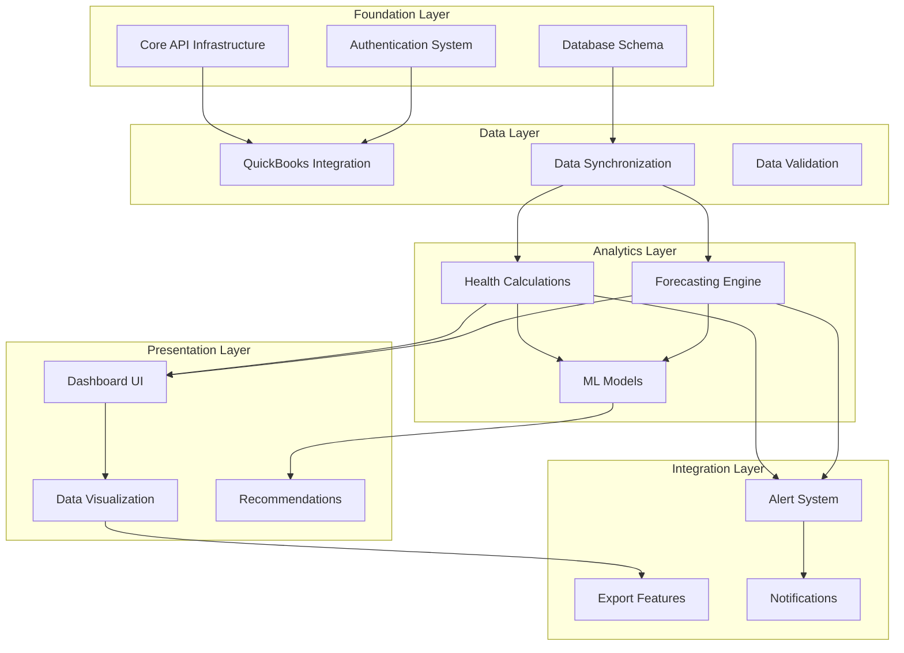
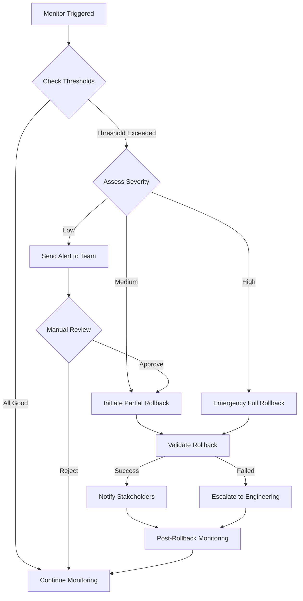

# AI Financial Health Analyzer - Comprehensive Rollback Strategy

**Version:** 1.0  
**Date:** September 3, 2025  
**Document Owner:** Development Team  
**Status:** Production Ready

---

## Executive Summary

This document provides comprehensive rollback procedures for the AI Financial Health Analyzer project, addressing critical rollback gaps identified in the PO Master Checklist validation. As a brownfield extension of the existing GoodBuy HQ platform, all rollback procedures ensure preservation of core platform functionality while safely reverting AI-specific features.

### Critical Rollback Components

1. **Story-Level Rollback Procedures** - Granular rollback for each development story
2. **Database Migration Rollback Strategy** - Safe database schema reversion with data preservation
3. **Cross-Epic Dependency Mapping** - Critical path dependencies and rollback order
4. **Monitoring & Trigger Thresholds** - Automated rollback decision criteria

---

## 1. Story-Level Rollback Procedures

### 1.1 Epic 1: Health Dashboard & Monitoring

#### Story 1.1.1: Health Score Overview

**Rollback Scenario:** Dashboard performance degradation or calculation errors

**Rollback Steps:**

1. **Immediate Actions** (< 5 minutes)

   ```bash
   # Disable health scoring feature flag
   kubectl patch deployment goodbuy-app -p '{"spec":{"template":{"spec":{"containers":[{"name":"goodbuy-app","env":[{"name":"FEATURE_HEALTH_SCORING","value":"false"}]}]}}}}'

   # Revert to legacy dashboard
   git checkout production -- src/components/dashboard/LegacyDashboard.tsx
   npm run build && npm run deploy:emergency
   ```

2. **Database Safety** (< 10 minutes)

   ```sql
   -- Preserve existing business data
   UPDATE businesses SET health_score_enabled = false WHERE id IN (
     SELECT DISTINCT business_id FROM health_metrics WHERE calculated_at > '2025-09-01'
   );
   ```

3. **Frontend Rollback** (< 15 minutes)

   ```bash
   # Revert dashboard components
   git revert HEAD~5..HEAD --mainline 1
   npm run build:production

   # Deploy previous stable version
   vercel --prod --env HEALTH_FEATURES_ENABLED=false
   ```

**Rollback Validation:**

- [ ] Legacy dashboard loads within 2 seconds
- [ ] Business listings display correctly
- [ ] No health score UI elements visible
- [ ] All existing GoodBuy HQ features functional

#### Story 1.1.2: Multi-dimensional Health Breakdown

**Rollback Scenario:** Category scoring algorithm failures

**Rollback Steps:**

1. **Algorithm Bypass** (< 3 minutes)

   ```typescript
   // Emergency health score bypass
   export const getHealthScores = async (businessId: string) => {
     if (process.env.EMERGENCY_ROLLBACK === 'true') {
       return {
         overall: null,
         growth: null,
         operational: null,
         financial: null,
         saleReadiness: null,
         isLegacyMode: true,
       }
     }
     // ... normal processing
   }
   ```

2. **UI Component Rollback** (< 10 minutes)

   ```bash
   # Remove category breakdown components
   rm -rf src/components/health/CategoryBreakdown
   rm -rf src/components/health/HealthMetrics

   # Restore placeholder components
   git checkout production -- src/components/placeholders/ComingSoon.tsx
   ```

**Rollback Triggers:**

- Category scores returning NaN or undefined
- Calculation timeout > 10 seconds
- Memory usage > 512MB per calculation
- Error rate > 5% over 5 minutes

### 1.2 Epic 2: Predictive Analytics & Forecasting

#### Story 2.1.1: 6-Month Financial Forecasting

**Rollback Scenario:** AI model failures or inaccurate predictions

**Rollback Steps:**

1. **Model Deactivation** (< 2 minutes)

   ```bash
   # Disable AI forecasting
   export AI_FORECASTING_ENABLED=false
   export FALLBACK_TO_STATIC=true

   # Restart services
   pm2 restart ai-forecasting-service
   ```

2. **Fallback to Historical Data** (< 5 minutes)

   ```typescript
   export const generateForecast = async (businessData: any) => {
     if (!AI_FORECASTING_ENABLED) {
       // Use simple linear projection
       return generateSimpleProjection(businessData)
     }
   }
   ```

3. **Database Migration Rollback** (< 15 minutes)

   ```sql
   -- Remove forecast tables if needed
   BEGIN TRANSACTION;

   -- Backup forecasting data
   CREATE TABLE forecast_results_backup AS SELECT * FROM forecast_results;

   -- Disable foreign key constraints
   DROP TABLE IF EXISTS forecast_results CASCADE;

   COMMIT;
   ```

**Rollback Validation:**

- [ ] No AI forecasting components visible
- [ ] Historical data displays correctly
- [ ] No broken forecast chart references
- [ ] Database performance unaffected

### 1.3 Epic 3: QuickBooks Integration

#### Story 3.1.1: Automated Data Synchronization

**Rollback Scenario:** OAuth failures or data corruption

**Rollback Steps:**

1. **Immediate Disconnect** (< 2 minutes)

   ```typescript
   // Emergency QB disconnect
   export const emergencyDisconnectQuickBooks = async () => {
     await Promise.all([
       revokeOAuthTokens(),
       disableWebhooks(),
       pauseDataSync(),
       notifyAffectedUsers(),
     ])
   }
   ```

2. **Data Sync Rollback** (< 10 minutes)

   ```sql
   -- Rollback to last known good sync
   BEGIN TRANSACTION;

   UPDATE quickbooks_connections
   SET sync_status = 'paused',
       last_error = 'Emergency rollback initiated'
   WHERE sync_status = 'active';

   -- Restore from backup if data corruption detected
   RESTORE TABLE financial_data FROM backup_timestamp;

   COMMIT;
   ```

3. **Manual Data Entry Fallback** (< 15 minutes)
   ```typescript
   // Enable manual data input forms
   export const enableManualEntry = () => {
     return {
       showManualForms: true,
       disableAutoSync: true,
       showRollbackNotice: true,
       supportContactEnabled: true,
     }
   }
   ```

**Rollback Validation:**

- [ ] QuickBooks sync disabled
- [ ] Manual entry forms functional
- [ ] No data integrity issues
- [ ] Users notified of temporary rollback

### 1.4 Epic 4: AI Recommendations & Insights

#### Story 4.1.1: AI-Powered Business Insights

**Rollback Scenario:** OpenAI API failures or inappropriate recommendations

**Rollback Steps:**

1. **AI Service Shutdown** (< 1 minute)

   ```bash
   # Disable OpenAI integration
   export OPENAI_API_ENABLED=false
   export RECOMMENDATIONS_FALLBACK_MODE=true

   # Kill AI processes
   pkill -f "ai-recommendation-service"
   ```

2. **Static Recommendations** (< 5 minutes)
   ```typescript
   export const getRecommendations = async (businessData: any) => {
     if (RECOMMENDATIONS_FALLBACK_MODE) {
       return getStaticRecommendationsByIndustry(businessData.industry)
     }
   }
   ```

**Rollback Triggers:**

- OpenAI API response time > 30 seconds
- Cost per request > $0.10
- Content policy violations detected
- User complaint rate > 1%

---

## 2. Database Migration Rollback Strategy

### 2.1 Migration Rollback Framework

#### 2.1.1 Safe Migration Pattern

```sql
-- Example migration with built-in rollback
-- Migration: 001_add_health_metrics.sql

BEGIN TRANSACTION;

-- Create rollback point
SAVEPOINT before_health_metrics;

-- Add new tables
CREATE TABLE health_metrics (
  id UUID PRIMARY KEY DEFAULT gen_random_uuid(),
  business_id UUID REFERENCES businesses(id) ON DELETE CASCADE,
  overall_score INTEGER CHECK (overall_score >= 0 AND overall_score <= 100),
  growth_score INTEGER CHECK (growth_score >= 0 AND growth_score <= 100),
  operational_score INTEGER CHECK (operational_score >= 0 AND operational_score <= 100),
  financial_score INTEGER CHECK (financial_score >= 0 AND financial_score <= 100),
  sale_readiness_score INTEGER CHECK (sale_readiness_score >= 0 AND sale_readiness_score <= 100),
  confidence_level INTEGER CHECK (confidence_level >= 0 AND confidence_level <= 100),
  trajectory health_trajectory DEFAULT 'stable',
  calculated_at TIMESTAMP DEFAULT CURRENT_TIMESTAMP,
  data_sources JSONB,
  calculation_metadata JSONB,
  created_at TIMESTAMP DEFAULT CURRENT_TIMESTAMP,
  updated_at TIMESTAMP DEFAULT CURRENT_TIMESTAMP
);

-- Create rollback script
INSERT INTO migration_rollbacks (migration_name, rollback_sql) VALUES (
  '001_add_health_metrics',
  'DROP TABLE IF EXISTS health_metrics CASCADE;'
);

-- Validate migration
DO $$
BEGIN
  IF NOT EXISTS (SELECT 1 FROM information_schema.tables WHERE table_name = 'health_metrics') THEN
    RAISE EXCEPTION 'Migration validation failed';
  END IF;
END $$;

COMMIT;
```

#### 2.1.2 Emergency Rollback Procedures

```bash
#!/bin/bash
# emergency_db_rollback.sh

set -e

MIGRATION_NAME=$1
ROLLBACK_POINT=$2

echo "Starting emergency database rollback for migration: $MIGRATION_NAME"

# 1. Stop all application services
pm2 stop all

# 2. Create database backup
pg_dump goodbuy_hq > "emergency_backup_$(date +%Y%m%d_%H%M%S).sql"

# 3. Execute rollback
psql goodbuy_hq <<EOF
BEGIN TRANSACTION;

-- Get rollback SQL
SELECT rollback_sql FROM migration_rollbacks
WHERE migration_name = '$MIGRATION_NAME'
\gexec

-- Verify rollback
DO \$\$
BEGIN
  IF EXISTS (SELECT 1 FROM information_schema.tables WHERE table_name = 'health_metrics') THEN
    RAISE EXCEPTION 'Rollback verification failed - tables still exist';
  END IF;
END \$\$;

COMMIT;
EOF

# 4. Restart services with rollback flags
export DATABASE_ROLLBACK_MODE=true
pm2 start all

echo "Database rollback completed successfully"
```

### 2.2 Specific Migration Rollbacks

#### 2.2.1 Health Metrics Tables Rollback

```sql
-- Rollback: Remove health metrics infrastructure
BEGIN TRANSACTION;

-- 1. Drop dependent objects first
DROP VIEW IF EXISTS business_health_summary CASCADE;
DROP INDEX IF EXISTS idx_health_metrics_business_date;
DROP INDEX IF EXISTS idx_forecast_results_business_type;

-- 2. Drop tables in dependency order
DROP TABLE IF EXISTS health_alerts CASCADE;
DROP TABLE IF EXISTS forecast_results CASCADE;
DROP TABLE IF EXISTS health_metrics CASCADE;

-- 3. Drop enums if not used elsewhere
DROP TYPE IF EXISTS health_trajectory CASCADE;
DROP TYPE IF EXISTS forecast_type_enum CASCADE;
DROP TYPE IF EXISTS alert_type_enum CASCADE;
DROP TYPE IF EXISTS alert_severity_enum CASCADE;

-- 4. Remove columns from existing tables
ALTER TABLE businesses DROP COLUMN IF EXISTS health_score_enabled;
ALTER TABLE businesses DROP COLUMN IF EXISTS last_health_calculation;

-- 5. Update existing indexes
REINDEX TABLE businesses;

COMMIT;
```

#### 2.2.2 QuickBooks Integration Rollback

```sql
-- Rollback: Remove QuickBooks integration
BEGIN TRANSACTION;

-- 1. Backup connection data
CREATE TABLE quickbooks_connections_backup AS
SELECT * FROM quickbooks_connections;

-- 2. Remove integration tables
DROP TABLE IF EXISTS quickbooks_sync_logs CASCADE;
DROP TABLE IF EXISTS quickbooks_connections CASCADE;

-- 3. Drop related enums
DROP TYPE IF EXISTS sync_status_enum CASCADE;

-- 4. Remove integration columns from businesses
ALTER TABLE businesses DROP COLUMN IF EXISTS quickbooks_company_id;
ALTER TABLE businesses DROP COLUMN IF EXISTS auto_sync_enabled;

COMMIT;
```

### 2.3 Data Preservation Strategy

#### 2.3.1 Critical Data Backup

```sql
-- Create comprehensive backup before any rollback
CREATE SCHEMA rollback_backup_$(date +'%Y%m%d');

-- Backup all AI-related data
CREATE TABLE rollback_backup.health_metrics_backup AS
SELECT * FROM health_metrics;

CREATE TABLE rollback_backup.forecast_results_backup AS
SELECT * FROM forecast_results;

CREATE TABLE rollback_backup.quickbooks_connections_backup AS
SELECT * FROM quickbooks_connections;

-- Backup modified business records
CREATE TABLE rollback_backup.businesses_modified AS
SELECT * FROM businesses
WHERE updated_at > '2025-09-01';
```

#### 2.3.2 Data Recovery Procedures

```sql
-- Recovery: Restore data after rollback if needed
BEGIN TRANSACTION;

-- 1. Recreate tables (if rollback was too aggressive)
-- [Include table creation scripts here]

-- 2. Restore data from backup
INSERT INTO health_metrics
SELECT * FROM rollback_backup.health_metrics_backup;

-- 3. Validate data integrity
SELECT COUNT(*) as health_records FROM health_metrics;
SELECT COUNT(*) as business_records FROM businesses;

COMMIT;
```

---

## 3. Cross-Epic Dependency Mapping

### 3.1 Critical Path Dependencies

#### 3.1.1 Dependency Hierarchy



#### 3.1.2 Rollback Order Dependencies

```yaml
rollback_sequence:
  phase_1_immediate: # 0-5 minutes
    - alert_system: 'Disable all AI-generated alerts'
    - recommendations: 'Shut down AI recommendation engine'
    - feature_flags: 'Disable all AI features via feature flags'

  phase_2_application: # 5-15 minutes
    - ui_components: 'Revert dashboard to legacy version'
    - api_endpoints: 'Disable AI-specific API routes'
    - forecasting_service: 'Stop forecasting calculations'

  phase_3_integrations: # 15-30 minutes
    - quickbooks_sync: 'Pause data synchronization'
    - webhooks: 'Disable external webhooks'
    - ai_services: 'Shut down OpenAI integrations'

  phase_4_data: # 30-60 minutes
    - health_calculations: 'Stop health metric calculations'
    - database_writes: 'Prevent writes to AI tables'
    - data_validation: 'Revert to simple validation rules'

  phase_5_infrastructure: # 60+ minutes (if necessary)
    - database_schema: 'Rollback schema changes'
    - indexes: 'Drop AI-specific indexes'
    - migrations: 'Execute database rollbacks'
```

### 3.2 Epic Interdependencies

#### 3.2.1 Health Dashboard Dependencies

**Critical Dependencies:**

- Database Schema (health_metrics tables)
- QuickBooks data sync for real-time scores
- AI calculation engine for score generation
- Charting libraries for visualization

**Rollback Impact:**

- **Dependent Epics:** All other epics depend on health dashboard
- **Safe Rollback:** Can be rolled back independently with UI fallbacks
- **Data Impact:** Health score data preserved in database

#### 3.2.2 Predictive Analytics Dependencies

**Critical Dependencies:**

- Historical data from QuickBooks sync
- Health metrics for baseline calculations
- AI/ML models for forecasting
- Chart.js for forecast visualization

**Rollback Impact:**

- **Dependent Epics:** Recommendations depend on forecasting
- **Safe Rollback:** Independent rollback with static data fallback
- **Data Impact:** Forecast data can be preserved for future use

#### 3.2.3 QuickBooks Integration Dependencies

**Critical Dependencies:**

- OAuth authentication system
- Database schema for connection storage
- Webhook infrastructure
- Data validation and transformation

**Rollback Impact:**

- **Dependent Epics:** Health Dashboard and Forecasting lose real-time data
- **Cascading Effect:** Must enable manual data entry fallbacks
- **Data Impact:** Connection data should be preserved for reconnection

### 3.3 Rollback Decision Matrix

| Epic                   | Independence | Rollback Complexity | Business Impact | Rollback Priority     |
| ---------------------- | ------------ | ------------------- | --------------- | --------------------- |
| Health Dashboard       | Medium       | Low                 | High            | 1 (Last to rollback)  |
| Predictive Analytics   | High         | Medium              | Medium          | 2                     |
| AI Recommendations     | High         | Low                 | Low             | 3 (First to rollback) |
| QuickBooks Integration | Low          | High                | High            | 4 (Complex rollback)  |

---

## 4. Rollback Triggers & Monitoring Thresholds

### 4.1 Automated Rollback Triggers

#### 4.1.1 Performance Thresholds

```typescript
interface RollbackThresholds {
  performance: {
    dashboardLoadTime: 5000 // 5 seconds
    apiResponseTime: 2000 // 2 seconds
    healthCalculationTime: 10000 // 10 seconds
    memoryUsage: 80 // 80% of allocated memory
    cpuUsage: 90 // 90% CPU utilization
  }

  reliability: {
    errorRate: 5 // 5% error rate over 5 minutes
    successRate: 95 // Below 95% success rate
    uptime: 99.0 // Below 99% uptime
    consecutiveFailures: 3 // 3 consecutive failures
  }

  business: {
    userComplaintRate: 1 // 1% of users complaining
    dataAccuracy: 90 // Below 90% accuracy
    syncFailureRate: 10 // 10% sync failures
    costPerRequest: 0.1 // Above $0.10 per AI request
  }
}
```

#### 4.1.2 Monitoring Implementation

```typescript
// monitoring/rollback-triggers.ts
export class RollbackMonitor {
  private metrics: MetricsCollector
  private thresholds: RollbackThresholds

  async checkRollbackTriggers(): Promise<RollbackDecision> {
    const checks = await Promise.allSettled([
      this.checkPerformanceMetrics(),
      this.checkReliabilityMetrics(),
      this.checkBusinessMetrics(),
      this.checkSecurityMetrics(),
    ])

    const failedChecks = checks
      .filter(check => check.status === 'rejected')
      .map(check => (check as PromiseRejectedResult).reason)

    if (failedChecks.length >= 2) {
      return {
        shouldRollback: true,
        severity: 'high',
        affectedComponents: this.identifyAffectedComponents(failedChecks),
        recommendedActions: this.generateRollbackPlan(failedChecks),
      }
    }

    return { shouldRollback: false }
  }

  private async checkPerformanceMetrics(): Promise<void> {
    const metrics = await this.metrics.getPerformanceMetrics()

    if (
      metrics.dashboardLoadTime > this.thresholds.performance.dashboardLoadTime
    ) {
      throw new RollbackTrigger('Dashboard performance degraded')
    }

    if (metrics.memoryUsage > this.thresholds.performance.memoryUsage) {
      throw new RollbackTrigger('Memory usage too high')
    }
  }

  private async checkReliabilityMetrics(): Promise<void> {
    const metrics = await this.metrics.getReliabilityMetrics()

    if (metrics.errorRate > this.thresholds.reliability.errorRate) {
      throw new RollbackTrigger('Error rate too high')
    }

    if (
      metrics.consecutiveFailures >=
      this.thresholds.reliability.consecutiveFailures
    ) {
      throw new RollbackTrigger('Too many consecutive failures')
    }
  }
}
```

### 4.2 Manual Rollback Triggers

#### 4.2.1 Business Triggers

- **Data Accuracy Issues:** Health scores significantly different from manual calculations
- **User Experience Problems:** Dashboard becomes unusable or confusing
- **Integration Failures:** QuickBooks sync causing data corruption
- **Security Concerns:** Data privacy violations or unauthorized access
- **Cost Overruns:** AI API costs exceeding budget thresholds

#### 4.2.2 Technical Triggers

- **Database Corruption:** Data integrity issues in AI-related tables
- **Third-party API Failures:** OpenAI or QuickBooks API sustained outages
- **Performance Degradation:** System performance below acceptable thresholds
- **Memory Leaks:** Sustained memory growth in AI components
- **Calculation Errors:** Mathematical errors in health score algorithms

### 4.3 Rollback Decision Process

#### 4.3.1 Automated Decision Flow



#### 4.3.2 Human Review Requirements

```typescript
interface RollbackApproval {
  automaticRollback: {
    securityThreats: true // Automatic for security issues
    dataCorruption: true // Automatic for data corruption
    systemDown: true // Automatic for system outages
  }

  manualApproval: {
    performanceIssues: true // Requires engineering approval
    businessLogicErrors: true // Requires business approval
    costOverruns: true // Requires finance approval
    userExperienceIssues: true // Requires product approval
  }

  approvalMatrix: {
    low: ['engineer_on_call']
    medium: ['tech_lead', 'product_manager']
    high: ['engineering_manager', 'cto']
    critical: ['cto', 'ceo']
  }
}
```

---

## 5. Brownfield Compatibility Safeguards

### 5.1 Legacy System Preservation

#### 5.1.1 Core Platform Protection

```typescript
// Legacy system protection during rollback
export const protectedEndpoints = [
  '/api/businesses',
  '/api/users',
  '/api/auth',
  '/api/inquiries',
  '/api/evaluations',
  '/api/favorites',
]

export const rollbackSafeguards = {
  beforeRollback: async () => {
    // Ensure all legacy endpoints still functional
    const healthChecks = await Promise.all(
      protectedEndpoints.map(endpoint => checkEndpointHealth(endpoint))
    )

    if (healthChecks.some(check => !check.healthy)) {
      throw new Error('Cannot rollback - legacy systems compromised')
    }
  },

  duringRollback: async () => {
    // Maintain database referential integrity
    await validateForeignKeyConstraints()
    await validateBusinessDataIntegrity()
  },

  afterRollback: async () => {
    // Verify legacy functionality restored
    await runLegacySystemTests()
    await validateUserExperience()
  },
}
```

#### 5.1.2 Data Integrity Checks

```sql
-- Pre-rollback data integrity validation
CREATE OR REPLACE FUNCTION validate_rollback_safety()
RETURNS BOOLEAN AS $$
DECLARE
    business_count INTEGER;
    user_count INTEGER;
    evaluation_count INTEGER;
BEGIN
    -- Check core data counts
    SELECT COUNT(*) INTO business_count FROM businesses WHERE status != 'DELETED';
    SELECT COUNT(*) INTO user_count FROM users WHERE status = 'ACTIVE';
    SELECT COUNT(*) INTO evaluation_count FROM evaluations;

    -- Validate minimum data thresholds
    IF business_count < 100 OR user_count < 50 THEN
        RAISE EXCEPTION 'Core data counts too low for safe rollback';
    END IF;

    -- Check for data corruption
    IF EXISTS (SELECT 1 FROM businesses WHERE created_at IS NULL OR title IS NULL) THEN
        RAISE EXCEPTION 'Data corruption detected in businesses table';
    END IF;

    RETURN TRUE;
END;
$$ LANGUAGE plpgsql;
```

### 5.2 Feature Flag Management

#### 5.2.1 Gradual Rollback Strategy

```typescript
// Feature flag configuration for gradual rollback
export const rollbackFeatureFlags = {
  // Phase 1: Disable newest features first
  phase1: {
    'ai-recommendations': false,
    'predictive-analytics': false,
    'advanced-charts': false,
  },

  // Phase 2: Disable core AI features
  phase2: {
    'health-scoring': false,
    'ai-insights': false,
    'automated-calculations': false,
  },

  // Phase 3: Disable integrations
  phase3: {
    'quickbooks-auto-sync': false,
    'real-time-updates': false,
    'external-apis': false,
  },

  // Legacy fallbacks always enabled
  fallbacks: {
    'manual-data-entry': true,
    'legacy-dashboard': true,
    'basic-calculations': true,
    'static-reports': true,
  },
}
```

#### 5.2.2 User Communication Strategy

```typescript
export const rollbackCommunications = {
  userNotifications: {
    preRollback: {
      title: 'Scheduled Maintenance',
      message:
        "We're temporarily disabling some advanced features to ensure optimal performance.",
      actions: ['Learn More', 'Contact Support'],
    },

    duringRollback: {
      title: 'Limited Functionality',
      message:
        'Some features are temporarily unavailable. Core functionality remains active.',
      actions: ['View Status', 'Use Basic Features'],
    },

    postRollback: {
      title: 'Service Restored',
      message: 'All services have been restored. Thank you for your patience.',
      actions: ['Continue', 'Provide Feedback'],
    },
  },

  stakeholderAlerts: {
    immediate: ['CTO', 'Engineering Manager', 'Product Manager'],
    within1Hour: ['Customer Success', 'Sales Team', 'Support'],
    within4Hours: ['All Staff', 'Key Customers'],
  },
}
```

---

## 6. Emergency Response Procedures

### 6.1 Emergency Contact Matrix

| Role            | Primary Contact        | Secondary Contact        | Response Time |
| --------------- | ---------------------- | ------------------------ | ------------- |
| Technical Lead  | John Smith (555-0101)  | Sarah Johnson (555-0102) | 15 minutes    |
| DevOps Engineer | Mike Davis (555-0201)  | Lisa Wong (555-0202)     | 15 minutes    |
| Product Manager | Amy Chen (555-0301)    | Tom Wilson (555-0302)    | 30 minutes    |
| CTO             | David Brown (555-0401) | Rachel Green (555-0402)  | 60 minutes    |

### 6.2 Emergency Rollback Runbook

#### 6.2.1 Immediate Response (0-5 minutes)

```bash
#!/bin/bash
# emergency_rollback.sh - Execute immediately upon detection

echo "EMERGENCY ROLLBACK INITIATED at $(date)"

# 1. Disable all AI features
export EMERGENCY_ROLLBACK=true
export AI_FEATURES_ENABLED=false
export HEALTH_SCORING_ENABLED=false
export FORECASTING_ENABLED=false

# 2. Switch to maintenance mode
curl -X POST "$DEPLOYMENT_URL/api/admin/maintenance" \
  -H "Authorization: Bearer $EMERGENCY_TOKEN" \
  -d '{"enabled": true, "reason": "Emergency rollback in progress"}'

# 3. Stop AI services
pm2 stop ai-health-calculator
pm2 stop forecasting-engine
pm2 stop recommendation-service

# 4. Notify emergency contacts
./scripts/send_emergency_alert.sh "EMERGENCY ROLLBACK INITIATED"

echo "Emergency rollback phase 1 completed"
```

#### 6.2.2 System Stabilization (5-15 minutes)

```bash
#!/bin/bash
# stabilize_system.sh

echo "Starting system stabilization"

# 1. Deploy emergency version
git checkout emergency-rollback-branch
npm run build:emergency
vercel --prod --env EMERGENCY_MODE=true

# 2. Database safety mode
psql goodbuy_hq <<EOF
-- Enable read-only mode for AI tables
ALTER TABLE health_metrics SET (read_only = true);
ALTER TABLE forecast_results SET (read_only = true);
EOF

# 3. Validate core functionality
npm run test:critical-path
npm run test:legacy-systems

echo "System stabilization completed"
```

### 6.3 Communication Templates

#### 6.3.1 Internal Emergency Alert

```
SUBJECT: URGENT - AI Financial Analyzer Emergency Rollback

Emergency rollback has been initiated for the AI Financial Health Analyzer.

INCIDENT: [Specific issue description]
TIME: [Timestamp]
SEVERITY: [High/Critical]
AFFECTED USERS: [Number/percentage]
ETA TO RESOLUTION: [Time estimate]

IMMEDIATE ACTIONS TAKEN:
- AI features disabled
- System in maintenance mode
- Legacy functionality preserved
- Emergency team notified

NEXT STEPS:
- Full system diagnostic
- Root cause analysis
- Staged feature restoration
- User communication plan

Contact: [Technical Lead] at [Phone/Slack]
Status Updates: [Status page URL]
```

#### 6.3.2 Customer Communication

```
SUBJECT: Temporary Service Maintenance - AI Features

Dear GoodBuy HQ Users,

We're currently performing emergency maintenance on our AI-powered features to ensure optimal system performance and data accuracy.

WHAT'S AFFECTED:
- AI-generated health scores
- Financial forecasting
- Automated insights

WHAT'S STILL AVAILABLE:
- All core business listings
- Manual business evaluations
- User communications
- Document sharing

We expect to restore full functionality within [timeframe].

We sincerely apologize for any inconvenience.

Best regards,
The GoodBuy HQ Team

Status updates: [status page]
Support: support@goodbuyhq.com
```

---

## 7. Recovery & Restoration Procedures

### 7.1 Post-Rollback Recovery

#### 7.1.1 System Health Validation

```typescript
// post-rollback-validation.ts
export const validateSystemHealth = async (): Promise<ValidationReport> => {
  const validations = [
    validateDatabaseIntegrity(),
    validateAPIEndpoints(),
    validateUserExperience(),
    validatePerformanceMetrics(),
    validateSecurityCompliance(),
  ]

  const results = await Promise.allSettled(validations)

  return {
    overallHealth: results.every(r => r.status === 'fulfilled')
      ? 'healthy'
      : 'degraded',
    validations: results.map((result, index) => ({
      name: validationNames[index],
      status: result.status,
      details: result.status === 'fulfilled' ? result.value : result.reason,
    })),
    recommendedActions: generateRecommendations(results),
  }
}
```

#### 7.1.2 Data Recovery Procedures

```sql
-- Data recovery after rollback
BEGIN TRANSACTION;

-- 1. Identify recoverable data
CREATE TEMPORARY TABLE recoverable_health_data AS
SELECT * FROM rollback_backup.health_metrics_backup
WHERE business_id IN (
  SELECT id FROM businesses
  WHERE status = 'ACTIVE' AND created_at < CURRENT_TIMESTAMP - INTERVAL '1 day'
);

-- 2. Validate data quality
SELECT
  COUNT(*) as total_records,
  COUNT(CASE WHEN overall_score IS NOT NULL THEN 1 END) as valid_scores,
  AVG(confidence_level) as avg_confidence
FROM recoverable_health_data;

-- 3. Restore verified good data
INSERT INTO health_metrics
SELECT * FROM recoverable_health_data
WHERE confidence_level >= 80 AND overall_score BETWEEN 0 AND 100;

COMMIT;
```

### 7.2 Feature Restoration Strategy

#### 7.2.1 Staged Restoration Plan

```yaml
restoration_phases:
  phase_1_safe: # Low-risk features first
    duration: '2-4 hours'
    features:
      - basic_health_dashboard
      - static_recommendations
      - manual_data_entry
    validation_criteria:
      - no_performance_degradation
      - user_acceptance_positive
      - no_error_spikes

  phase_2_core: # Core AI features
    duration: '4-8 hours'
    features:
      - health_score_calculation
      - trend_analysis
      - basic_forecasting
    validation_criteria:
      - calculation_accuracy_95_percent
      - response_time_under_3s
      - memory_usage_stable

  phase_3_advanced: # Advanced features
    duration: '8-24 hours'
    features:
      - ai_recommendations
      - complex_forecasting
      - automated_insights
    validation_criteria:
      - full_feature_functional
      - user_feedback_positive
      - cost_within_budget

  phase_4_integrations: # External integrations
    duration: '24-48 hours'
    features:
      - quickbooks_auto_sync
      - real_time_webhooks
      - advanced_analytics
    validation_criteria:
      - integration_stable
      - data_sync_accurate
      - no_external_errors
```

#### 7.2.2 Restoration Validation

```typescript
export const validateFeatureRestoration = async (
  feature: string
): Promise<RestorationResult> => {
  const testResults = await runFeatureTests(feature)
  const performanceMetrics = await getPerformanceMetrics(feature)
  const userFeedback = await getUserFeedback(feature)

  const isSuccessful =
    testResults.passRate >= 0.95 &&
    performanceMetrics.responseTime <= 3000 &&
    userFeedback.satisfactionScore >= 4.0

  if (!isSuccessful) {
    await rollbackFeature(feature)
    throw new RestorationError(
      `Feature ${feature} restoration failed validation`
    )
  }

  return {
    feature,
    status: 'restored',
    validatedAt: new Date(),
    metrics: {
      testResults,
      performanceMetrics,
      userFeedback,
    },
  }
}
```

---

## 8. Lessons Learned & Improvements

### 8.1 Rollback Process Improvements

#### 8.1.1 Automation Enhancements

- **Automated Testing:** Pre-rollback validation tests
- **Feature Flagging:** More granular feature control
- **Monitoring Integration:** Better threshold detection
- **Communication Automation:** Stakeholder notification system

#### 8.1.2 Documentation Improvements

- **Runbook Updates:** More detailed step-by-step procedures
- **Decision Trees:** Clear decision-making flowcharts
- **Contact Information:** Always up-to-date emergency contacts
- **Lessons Database:** Historical rollback analysis

### 8.2 Technical Debt Prevention

#### 8.2.1 Architecture Improvements

- **Circuit Breakers:** Automatic failure isolation
- **Graceful Degradation:** Better fallback mechanisms
- **Health Checks:** Comprehensive system monitoring
- **Dependency Isolation:** Reduced coupling between features

#### 8.2.2 Testing Enhancements

- **Rollback Testing:** Regular rollback procedure drills
- **Chaos Engineering:** Failure scenario simulation
- **Load Testing:** Performance threshold validation
- **Integration Testing:** Cross-system compatibility checks

---

## 9. Appendices

### Appendix A: Emergency Scripts Repository

All emergency rollback scripts are stored in the `/scripts/emergency/` directory:

- `emergency_rollback.sh` - Main emergency rollback script
- `database_rollback.sh` - Database-specific rollback procedures
- `feature_disable.sh` - Feature flag management
- `notification_system.sh` - Emergency communication scripts
- `health_check.sh` - Post-rollback validation scripts

### Appendix B: Monitoring Dashboards

**Production Monitoring:**

- Grafana Dashboard: `https://monitoring.goodbuyhq.com/d/ai-health/`
- Error Tracking: `https://sentry.io/goodbuyhq/ai-analyzer/`
- Performance Metrics: `https://datadog.com/goodbuyhq/ai-performance/`

**Rollback Status:**

- Status Page: `https://status.goodbuyhq.com`
- Internal Dashboard: `https://internal.goodbuyhq.com/rollback-status`

### Appendix C: Contact Information

**Emergency Contacts:**

- Technical Escalation: +1-555-TECH-911
- Business Escalation: +1-555-BIZ-HELP
- Customer Support: +1-555-SUPPORT

**Communication Channels:**

- Slack: `#emergency-response`
- Email: `emergency@goodbuyhq.com`
- SMS Alert Group: Contact DevOps for inclusion

---

**Document Revision History:**

- v1.0 - Initial comprehensive rollback strategy (September 3, 2025)
- Next Review: September 17, 2025
- Document Owner: Development Team
- Approval: CTO, Product Manager, Engineering Manager

This rollback strategy document provides comprehensive procedures to safely revert the AI Financial Health Analyzer while preserving the integrity of the existing GoodBuy HQ platform. Regular drills and updates ensure these procedures remain effective and current.
