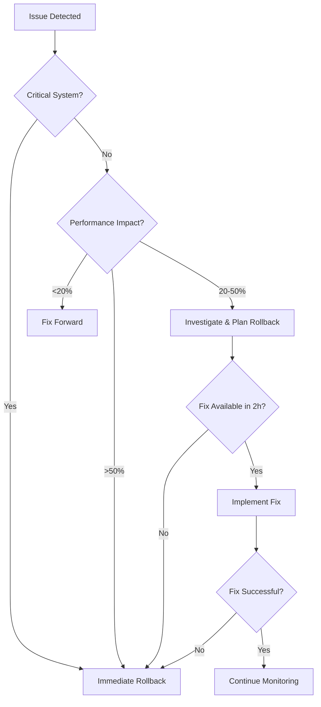

# ShadCN UI Design System Architecture for GoodBuy HQ

## Executive Summary

This document outlines the comprehensive architecture for integrating ShadCN UI v4 design system into GoodBuy HQ's business marketplace platform. The integration will establish a modern, scalable, and accessible component library that maintains consistency across all user interfaces while supporting the platform's business-focused requirements.

## Current State Analysis

### Existing Infrastructure

- **Framework**: Next.js 14.2.32 with App Router
- **Styling**: Tailwind CSS 3.4.17 with custom design tokens
- **TypeScript**: 5.7.2 with strict type checking
- **Component Structure**: Partial ShadCN implementation with basic components

### Current ShadCN Components (Implemented)

- ✅ Button (with CVA variants)
- ✅ Card (with all sub-components)
- ✅ Input (basic implementation)
- ✅ Select (Radix UI based)
- ✅ Tabs (complete implementation)
- ✅ Badge (status indicators)
- ✅ Avatar (with fallback support)
- ✅ Progress (animated progress bars)

### Missing Critical Components

- 🔲 **Form Components**: Form, FormField, FormItem, FormLabel, FormControl, FormDescription, FormMessage
- 🔲 **Navigation**: NavigationMenu, Breadcrumb, Pagination
- 🔲 **Data Display**: Table, DataTable, Sheet, Dialog, AlertDialog
- 🔲 **Feedback**: Toast, Alert, Skeleton, Spinner
- 🔲 **Layout**: Separator, Accordion, Collapsible, ScrollArea
- 🔲 **Advanced**: Calendar, DatePicker, Command, Popover, DropdownMenu
- 🔲 **Business-Specific**: Charts integration, Dashboard widgets

## Design System Architecture

### 1. Theme Configuration

#### Custom Business Color Palette

```css
:root {
  /* Business Primary Colors */
  --primary: 214 100% 40%; /* GoodBuy Blue #1e40af */
  --primary-foreground: 210 40% 98%;

  /* Success/Growth Colors */
  --success: 158 64% 52%; /* Growth Green #059669 */
  --success-foreground: 210 40% 98%;

  /* Warning/Attention Colors */
  --warning: 25 95% 53%; /* Attention Amber #d97706 */
  --warning-foreground: 210 40% 98%;

  /* Semantic Colors */
  --destructive: 0 84% 60%; /* Error Red */
  --destructive-foreground: 210 40% 98%;

  /* Neutral Palette */
  --background: 0 0% 100%; /* Pure White */
  --foreground: 222 84% 5%; /* Near Black */
  --muted: 210 40% 96%; /* Light Gray */
  --muted-foreground: 215 16% 47%; /* Medium Gray */

  /* Interactive Elements */
  --border: 214 32% 91%; /* Subtle Border */
  --input: 214 32% 91%; /* Input Background */
  --ring: 214 100% 40%; /* Focus Ring */
  --radius: 0.5rem; /* 8px Border Radius */
}
```

#### Typography Scale

- **Display**: Lexend (Headlines, Hero text)
- **Interface**: Inter (UI elements, body text)
- **Monospace**: JetBrains Mono (Code, data)

#### Spacing System

- Base unit: 4px (0.25rem)
- Consistent scale: 4px, 8px, 12px, 16px, 20px, 24px, 32px, 40px, 48px, 64px

### 2. Component Structure

```
src/
├── components/
│   ├── ui/                      # Core ShadCN components
│   │   ├── button.tsx           ✅ Implemented
│   │   ├── card.tsx             ✅ Implemented
│   │   ├── form.tsx             🔲 To implement
│   │   ├── table.tsx            🔲 To implement
│   │   ├── dialog.tsx           🔲 To implement
│   │   ├── toast.tsx            🔲 To implement
│   │   └── [30+ more components]
│   ├── business/                # Business-specific components
│   │   ├── business-card.tsx    # Enhanced card for listings
│   │   ├── valuation-display.tsx
│   │   ├── inquiry-form.tsx
│   │   └── dashboard-widgets/
│   ├── layout/                  # Layout components
│   │   ├── header.tsx           ✅ Existing
│   │   ├── footer.tsx           ✅ Existing
│   │   ├── sidebar.tsx          🔲 To implement
│   │   └── navigation.tsx       🔲 To implement
│   └── examples/                # Component showcase
│       └── ShadcnShowcase.tsx   ✅ Implemented
```

### 3. Configuration Files

#### components.json (ShadCN CLI Configuration)

```json
{
  "$schema": "https://ui.shadcn.com/schema.json",
  "style": "default",
  "rsc": true,
  "tsx": true,
  "tailwind": {
    "config": "tailwind.config.ts",
    "css": "src/app/globals.css",
    "baseColor": "slate",
    "cssVariables": true,
    "prefix": ""
  },
  "aliases": {
    "components": "@/components",
    "utils": "@/lib/utils"
  }
}
```

## Migration Strategy

### Phase 1: Foundation Setup (Week 1)

1. **Install ShadCN CLI and dependencies**
   - `npx shadcn-ui@latest init`
   - Configure components.json
   - Update Tailwind config with business colors

2. **Core Components Implementation**
   - Form components (high priority for business forms)
   - Dialog/Modal system (inquiry modals, confirmations)
   - Toast notifications (user feedback)
   - Table components (business listings, data tables)

3. **Theme Integration**
   - Implement custom color tokens
   - Configure typography scales
   - Set up animation system

### Phase 2: Business Components (Week 2)

1. **Enhanced Business Cards**
   - Listing cards with ShadCN styling
   - Interactive states and hover effects
   - Responsive design patterns

2. **Dashboard Widgets**
   - Analytics cards with proper spacing
   - Chart integration with ShadCN aesthetics
   - Status indicators and badges

3. **Navigation Components**
   - Professional header with dropdowns
   - Breadcrumb navigation
   - Sidebar navigation for dashboards

### Phase 3: Advanced Features (Week 3)

1. **Data Management**
   - Advanced table with sorting, filtering
   - Calendar components for scheduling
   - Command palette for quick actions

2. **User Experience Enhancements**
   - Loading states with skeletons
   - Error boundaries with alerts
   - Confirmation dialogs with proper UX

3. **Accessibility & Performance**
   - ARIA compliance across components
   - Keyboard navigation
   - Performance optimization

## Component Requirements

### 1. Business Listing Components

```typescript
interface BusinessCardProps {
  business: Business
  variant: 'compact' | 'detailed' | 'featured'
  showActions?: boolean
  onInquiry?: () => void
  onFavorite?: () => void
}

// Enhanced card with ShadCN styling
<BusinessCard
  business={business}
  variant="detailed"
  showActions={true}
  className="hover:shadow-lg transition-all duration-200"
/>
```

### 2. Form Components

```typescript
// Business inquiry form with proper validation
<Form>
  <FormField name="message">
    <FormLabel>Inquiry Message</FormLabel>
    <FormControl>
      <Textarea placeholder="Tell us about your interest..." />
    </FormControl>
    <FormMessage />
  </FormField>
  <Button type="submit">Send Inquiry</Button>
</Form>
```

### 3. Dashboard Widgets

```typescript
interface DashboardCardProps {
  title: string
  value: string | number
  change?: {
    value: number
    trend: 'up' | 'down' | 'neutral'
  }
  icon?: React.ComponentType
}

// Analytics widget with ShadCN styling
<DashboardCard
  title="Active Listings"
  value={127}
  change={{ value: 12, trend: 'up' }}
  icon={Building}
/>
```

## Design Principles

### 1. Professional Business Aesthetic

- **Conservative Color Usage**: Primarily blues and grays with selective accent colors
- **High Contrast**: Ensure readability for business users
- **Clean Typography**: Professional font choices with clear hierarchy

### 2. Responsive Design Patterns

- **Mobile-First**: All components work on mobile devices
- **Progressive Enhancement**: Desktop features don't break mobile experience
- **Flexible Layouts**: Components adapt to various screen sizes

### 3. Accessibility Standards

- **WCAG 2.1 AA Compliance**: Meet accessibility standards
- **Keyboard Navigation**: All interactive elements keyboard accessible
- **Screen Reader Support**: Proper ARIA labels and descriptions

### 4. Performance Considerations

- **Tree Shaking**: Only import used components
- **Lazy Loading**: Load heavy components on demand
- **Bundle Optimization**: Minimize CSS and JS bundle sizes

## Implementation Timeline

### Week 1: Foundation

- [ ] Configure ShadCN CLI and components.json
- [ ] Implement core form components
- [ ] Set up toast notification system
- [ ] Create business color theme

### Week 2: Business Components

- [ ] Enhanced business listing cards
- [ ] Dashboard analytics widgets
- [ ] Navigation components
- [ ] Table components for data display

### Week 3: Advanced Features

- [ ] Calendar and date picker components
- [ ] Command palette for quick actions
- [ ] Advanced table with sorting/filtering
- [ ] Error handling and loading states

### Week 4: Polish & Optimization

- [ ] Accessibility audit and improvements
- [ ] Performance optimization
- [ ] Documentation and examples
- [ ] Testing and QA

## Quality Assurance

### 1. Component Testing

- Unit tests for all components
- Integration tests for complex workflows
- Visual regression testing
- Accessibility testing

### 2. Performance Monitoring

- Bundle size analysis
- Core Web Vitals tracking
- Component render performance
- Memory usage optimization

### 3. Documentation Standards

- Storybook component documentation
- TypeScript interface documentation
- Usage examples and best practices
- Migration guides for existing components

## Success Metrics

### 1. Development Efficiency

- **Component Reuse**: 80% of UI uses ShadCN components
- **Development Speed**: 40% faster component development
- **Bug Reduction**: 50% fewer UI-related bugs

### 2. User Experience

- **Accessibility Score**: WCAG 2.1 AA compliance
- **Performance Score**: 90+ Lighthouse score
- **User Satisfaction**: Improved UI consistency ratings

### 3. Maintenance

- **Code Consistency**: Standardized component patterns
- **Update Efficiency**: Easy ShadCN version upgrades
- **Documentation Coverage**: 100% component documentation

## Risk Mitigation & Rollback Strategy

### 1. Comprehensive Rollback Strategy

#### Rollback Triggers & Thresholds

**Performance Thresholds**:

- Lighthouse Performance Score drops below 85
- First Contentful Paint increases by >20%
- Largest Contentful Paint exceeds 2.5s
- Cumulative Layout Shift exceeds 0.1
- Bundle size increases by >30%

**Error Rate Thresholds**:

- JavaScript errors increase by >50%
- Component rendering failures >5%
- User session errors >3%
- Critical business flow failures >1%

**User Experience Thresholds**:

- User satisfaction scores drop below 4.0/5.0
- Support tickets increase by >25%
- Accessibility score drops below WCAG 2.1 AA
- Mobile usability issues increase by >15%

#### Phase-Specific Rollback Procedures

**Phase 1 Foundation Rollback**:

```bash
# Emergency rollback script
#!/bin/bash
echo "Starting Phase 1 rollback..."

# 1. Restore previous component files
git checkout HEAD~1 -- src/components/ui/
git checkout HEAD~1 -- tailwind.config.ts
git checkout HEAD~1 -- components.json

# 2. Restore previous CSS variables
git checkout HEAD~1 -- src/app/globals.css
cp colors.md.backup colors.md

# 3. Reinstall previous dependencies
npm install --package-lock-only
npm ci

# 4. Rebuild and verify
npm run build
npm run test

echo "Phase 1 rollback complete"
```

**Phase 2 Business Components Rollback**:

```bash
#!/bin/bash
echo "Starting Phase 2 rollback..."

# 1. Restore business component files
git checkout HEAD~1 -- src/components/business/
git checkout HEAD~1 -- src/components/layout/

# 2. Restore page components that use business components
git checkout HEAD~1 -- src/app/businesses/
git checkout HEAD~1 -- src/app/dashboard/

# 3. Database schema rollback (if needed)
if [ -f "prisma/migrations/rollback.sql" ]; then
  npx prisma db execute --file prisma/migrations/rollback.sql
fi

# 4. Clear component cache and rebuild
rm -rf .next/cache/webpack
npm run build

echo "Phase 2 rollback complete"
```

**Phase 3 Advanced Features Rollback**:

```bash
#!/bin/bash
echo "Starting Phase 3 rollback..."

# 1. Restore advanced component files
git checkout HEAD~1 -- src/components/ui/calendar.tsx
git checkout HEAD~1 -- src/components/ui/command.tsx
git checkout HEAD~1 -- src/components/ui/data-table.tsx

# 2. Restore related configuration
git checkout HEAD~1 -- src/lib/utils.ts
git checkout HEAD~1 -- src/hooks/

# 3. Rollback API changes if any
git checkout HEAD~1 -- src/app/api/

echo "Phase 3 rollback complete"
```

### 2. Brownfield Safety Measures

#### Existing System Preservation

**Critical System Components (DO NOT MODIFY)**:

- User authentication system (`src/lib/auth/`)
- Payment processing (`src/lib/payments/`)
- Business listing database schemas
- Email notification system
- File upload/storage system
- Search indexing system

**Theme System Preservation**:

```typescript
// Theme compatibility layer
interface LegacyThemeMapping {
  // Preserve existing color variables
  'goodbuy-orange': string // #c96442
  'goodbuy-cream': string // #faf9f5
  'goodbuy-brown': string // #3d3929
}

// Automatic theme migration with fallbacks
const preserveExistingTheme = () => {
  const legacyColors = document.querySelector(':root')
  if (legacyColors) {
    // Backup existing theme
    localStorage.setItem(
      'legacy-theme',
      legacyColors.getAttribute('style') || ''
    )

    // Apply ShadCN theme while preserving critical colors
    legacyColors.style.setProperty('--primary', 'var(--goodbuy-orange)')
    legacyColors.style.setProperty('--background', 'var(--goodbuy-cream)')
  }
}
```

**Database Safety Measures**:

- No destructive schema changes during ShadCN migration
- All database operations maintain backward compatibility
- Existing data validation rules preserved
- API endpoints maintain existing contracts

#### Component Migration Safety

**Backward Compatibility Layer**:

```typescript
// Legacy component wrapper
interface LegacyComponentProps {
  legacyMode?: boolean;
  fallbackComponent?: React.ComponentType;
}

const withLegacySupport = <T extends {}>(Component: React.ComponentType<T>) => {
  return (props: T & LegacyComponentProps) => {
    const { legacyMode, fallbackComponent: FallbackComponent, ...rest } = props;

    if (legacyMode && FallbackComponent) {
      return <FallbackComponent {...rest} />;
    }

    try {
      return <Component {...rest} />;
    } catch (error) {
      console.error('ShadCN component error:', error);
      return FallbackComponent ? <FallbackComponent {...rest} /> : null;
    }
  };
};
```

### 3. Monitoring & Alerting System

#### Real-Time Performance Monitoring

**Component Performance Tracking**:

```typescript
// Performance monitoring for ShadCN components
const componentPerformanceMonitor = {
  trackRender: (componentName: string, renderTime: number) => {
    if (renderTime > 16) {
      // 60fps threshold
      console.warn(`Slow render: ${componentName} took ${renderTime}ms`)

      // Send alert if threshold exceeded
      fetch('/api/monitoring/performance', {
        method: 'POST',
        body: JSON.stringify({
          component: componentName,
          renderTime,
          timestamp: Date.now(),
          threshold: 'EXCEEDED',
        }),
      })
    }
  },

  trackError: (componentName: string, error: Error) => {
    fetch('/api/monitoring/errors', {
      method: 'POST',
      body: JSON.stringify({
        component: componentName,
        error: error.message,
        stack: error.stack,
        timestamp: Date.now(),
      }),
    })
  },
}
```

**Bundle Size Monitoring**:

```javascript
// webpack-bundle-analyzer integration
const bundleAnalyzer = require('webpack-bundle-analyzer')

const monitorBundleSize = {
  maxSize: {
    js: 500 * 1024, // 500KB
    css: 100 * 1024, // 100KB
  },

  analyze: stats => {
    const assets = stats.toJson().assets
    const jsSize = assets
      .filter(asset => asset.name.endsWith('.js'))
      .reduce((total, asset) => total + asset.size, 0)

    if (jsSize > monitorBundleSize.maxSize.js) {
      throw new Error(
        `Bundle size exceeded: ${jsSize} > ${monitorBundleSize.maxSize.js}`
      )
    }
  },
}
```

#### Automated Health Checks

**Component Health Dashboard**:

```typescript
// Health check endpoint
export async function GET() {
  const healthChecks = {
    shadcnComponents: await checkShadcnComponents(),
    themeSystem: await checkThemeSystem(),
    performance: await checkPerformanceMetrics(),
    accessibility: await checkAccessibility(),
    browserCompatibility: await checkBrowserSupport(),
  }

  const overall = Object.values(healthChecks).every(
    check => check.status === 'healthy'
  )

  return Response.json({
    status: overall ? 'healthy' : 'unhealthy',
    checks: healthChecks,
    timestamp: new Date().toISOString(),
  })
}

const checkShadcnComponents = async () => {
  const criticalComponents = ['Button', 'Card', 'Form', 'Dialog']
  const componentTests = await Promise.all(
    criticalComponents.map(async component => {
      try {
        // Component render test
        const result = await testComponentRender(component)
        return { component, status: 'healthy', renderTime: result.time }
      } catch (error) {
        return { component, status: 'unhealthy', error: error.message }
      }
    })
  )

  return {
    status: componentTests.every(test => test.status === 'healthy')
      ? 'healthy'
      : 'unhealthy',
    details: componentTests,
  }
}
```

### 4. Breaking Changes Prevention

#### API Contract Preservation

**Component Interface Compatibility**:

```typescript
// Interface versioning for backward compatibility
interface ButtonPropsV1 {
  variant?: 'primary' | 'secondary'
  size?: 'sm' | 'md' | 'lg'
}

interface ButtonPropsV2 extends ButtonPropsV1 {
  variant?:
    | 'default'
    | 'destructive'
    | 'outline'
    | 'secondary'
    | 'ghost'
    | 'link'
  size?: 'default' | 'sm' | 'lg' | 'icon'
}

// Migration adapter
const adaptLegacyProps = (props: ButtonPropsV1): ButtonPropsV2 => {
  return {
    ...props,
    variant:
      props.variant === 'primary' ? 'default' : props.variant || 'default',
    size: props.size === 'md' ? 'default' : props.size || 'default',
  }
}
```

**Gradual Migration Strategy**:

- Phase 1: Add ShadCN components alongside existing ones
- Phase 2: Create compatibility wrappers for legacy components
- Phase 3: Gradually replace legacy components with feature flags
- Phase 4: Remove legacy components after full validation

### 5. Performance Impact Prevention

#### Bundle Size Optimization

**Tree Shaking Configuration**:

```javascript
// webpack.config.js optimization
module.exports = {
  optimization: {
    usedExports: true,
    sideEffects: false,
    splitChunks: {
      chunks: 'all',
      cacheGroups: {
        shadcn: {
          test: /[\/]node_modules[\/]@radix-ui[\/]/,
          name: 'shadcn-ui',
          chunks: 'all',
        },
      },
    },
  },
  resolve: {
    alias: {
      '@/components/ui': path.resolve(__dirname, 'src/components/ui'),
    },
  },
}
```

**Performance Budget Enforcement**:

```javascript
// Performance budget configuration
const performanceBudgets = {
  'initial-js': 200 * 1024, // 200KB initial JS
  'total-js': 500 * 1024, // 500KB total JS
  css: 100 * 1024, // 100KB CSS
  fonts: 150 * 1024, // 150KB fonts
  images: 1000 * 1024, // 1MB images
}

// Budget validation in CI/CD
const validatePerformanceBudget = buildStats => {
  const violations = []

  Object.entries(performanceBudgets).forEach(([type, budget]) => {
    const actual = calculateAssetSize(buildStats, type)
    if (actual > budget) {
      violations.push({
        type,
        budget: formatBytes(budget),
        actual: formatBytes(actual),
        violation: formatBytes(actual - budget),
      })
    }
  })

  if (violations.length > 0) {
    throw new Error(
      `Performance budget violations: ${JSON.stringify(violations)}`
    )
  }
}
```

### 6. Team Adoption Safety

#### Training & Documentation

- **Component Migration Guide**: Step-by-step migration instructions
- **Error Recovery Procedures**: What to do when components fail
- **Rollback Decision Matrix**: When and how to trigger rollbacks
- **Performance Best Practices**: Optimizing ShadCN component usage

#### Code Review Safety Nets

```typescript
// ESLint rules for ShadCN safety
module.exports = {
  rules: {
    'shadcn/no-legacy-imports': 'error',
    'shadcn/require-error-boundaries': 'error',
    'shadcn/performance-check': 'warn',
    'shadcn/accessibility-check': 'error',
  },
}
```

## Emergency Response Procedures

### Incident Response Team

**Primary Contacts**:

- Technical Lead: Immediate rollback authority
- Product Owner: Business impact assessment
- DevOps Engineer: Infrastructure and deployment management
- QA Lead: Validation and testing coordination

### Escalation Matrix

**Level 1 (Minor Issues)**:

- Performance degradation <20%
- Non-critical component failures
- Aesthetic inconsistencies
  **Response**: Fix forward, monitor closely

**Level 2 (Moderate Issues)**:

- Performance degradation 20-50%
- Business flow interruptions
- Accessibility violations
  **Response**: Immediate investigation, rollback consideration

**Level 3 (Critical Issues)**:

- Performance degradation >50%
- Payment system failures
- Security vulnerabilities
- Data loss or corruption
  **Response**: Immediate rollback, full incident response

### Rollback Decision Tree



## Automated Rollback System

### CI/CD Integration

```yaml
# .github/workflows/shadcn-safety.yml
name: ShadCN Safety Checks

on:
  push:
    branches: [main]
  pull_request:
    branches: [main]

jobs:
  safety-checks:
    runs-on: ubuntu-latest
    steps:
      - uses: actions/checkout@v3

      - name: Performance Budget Check
        run: |
          npm run build
          npm run analyze-bundle

      - name: Component Health Check
        run: |
          npm run test:components
          npm run test:accessibility

      - name: Rollback Readiness Check
        run: |
          # Verify rollback scripts work
          chmod +x scripts/rollback-*.sh
          bash scripts/test-rollback.sh

      - name: Auto Rollback on Failure
        if: failure()
        run: |
          echo "Safety checks failed, initiating rollback..."
          bash scripts/emergency-rollback.sh

      - name: Notify Team
        if: failure()
        uses: 8398a7/action-slack@v3
        with:
          status: failure
          text: 'ShadCN deployment failed and was automatically rolled back'
```

### Monitoring Dashboard

```typescript
// Real-time monitoring dashboard component
const ShadcnHealthDashboard = () => {
  const [health, setHealth] = useState(null);
  const [metrics, setMetrics] = useState(null);

  useEffect(() => {
    const interval = setInterval(async () => {
      // Check system health
      const healthResponse = await fetch('/api/health/shadcn');
      const healthData = await healthResponse.json();
      setHealth(healthData);

      // Check performance metrics
      const metricsResponse = await fetch('/api/metrics/performance');
      const metricsData = await metricsResponse.json();
      setMetrics(metricsData);

      // Auto-trigger rollback if critical thresholds exceeded
      if (healthData.status === 'critical' || metricsData.performanceScore < 50) {
        await fetch('/api/emergency/rollback', { method: 'POST' });
      }
    }, 30000); // Check every 30 seconds

    return () => clearInterval(interval);
  }, []);

  return (
    <div className="p-4 border rounded-lg">
      <h2 className="text-lg font-semibold mb-4">ShadCN System Health</h2>

      <div className="grid grid-cols-2 gap-4">
        <HealthIndicator
          label="Component Status"
          status={health?.components?.status}
        />
        <HealthIndicator
          label="Performance Score"
          status={metrics?.performanceScore > 85 ? 'healthy' : 'warning'}
        />
        <HealthIndicator
          label="Bundle Size"
          status={metrics?.bundleSize < 500000 ? 'healthy' : 'critical'}
        />
        <HealthIndicator
          label="Error Rate"
          status={metrics?.errorRate < 0.01 ? 'healthy' : 'warning'}
        />
      </div>

      {health?.status === 'critical' && (
        <div className="mt-4 p-3 bg-red-100 border border-red-400 rounded">
          <p className="text-red-700 font-semibold">Critical Issue Detected</p>
          <p className="text-red-600">Automatic rollback may be initiated</p>
        </div>
      )}
    </div>
  );
};
```

## Success Validation Criteria

### Rollback Success Metrics

1. **System Recovery Time**: < 5 minutes for emergency rollbacks
2. **Data Integrity**: 100% data preservation during rollbacks
3. **User Experience**: No user-facing errors during rollback process
4. **Performance Recovery**: Return to baseline performance within 2 minutes

### Post-Rollback Procedures

1. **Incident Analysis**: Root cause analysis within 24 hours
2. **Improvement Plan**: Updated rollback procedures based on lessons learned
3. **Team Communication**: Clear communication of what happened and next steps
4. **Testing Enhancement**: Additional tests to prevent similar issues

## Conclusion

This enhanced ShadCN UI architecture provides comprehensive rollback strategies and risk mitigation measures to ensure safe integration into GoodBuy HQ's brownfield environment. The multi-layered safety approach includes automated monitoring, emergency procedures, and preservation of existing system functionality.

Key safety features include:

- **Automated rollback triggers** based on performance and error thresholds
- **Brownfield preservation** of critical existing systems
- **Theme system compatibility** maintaining existing design tokens
- **Real-time monitoring** with immediate alerting
- **Emergency response procedures** with clear escalation paths

The phased approach combined with comprehensive rollback strategies ensures minimal business disruption while enabling modern UI improvements. Each phase includes specific rollback procedures tested and validated before implementation.

**Next Steps**:

1. Set up monitoring infrastructure and rollback scripts
2. Conduct rollback procedure testing in staging environment
3. Begin Phase 1 implementation with safety measures active
4. Validate rollback triggers and thresholds with production-like load testing
