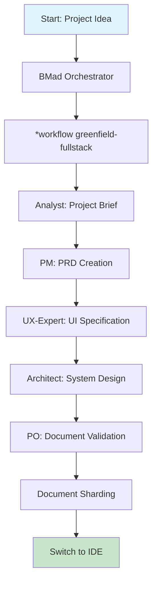
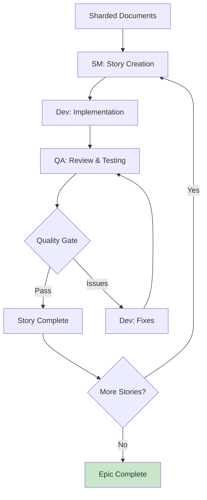

# BMAD Method Integration Guide

## System Overview

The BMAD (Business Method Agile Development) system is a sophisticated AI-driven development methodology that orchestrates 10 specialized agents through structured workflows to deliver production-ready applications from concept to deployment.

### Core Architecture

```
BMAD-Core System
├── 10 Specialized Agents (Analyst, PM, Architect, UX-Expert, PO, SM, Dev, QA, etc.)
├── 6 Complete Workflows (Greenfield/Brownfield × Fullstack/Service/UI)
├── 23+ Executable Tasks (Document creation, validation, implementation)
├── 13+ Professional Templates (PRD, Architecture, Stories, etc.)
├── 6+ Quality Checklists (Validation, standards, quality gates)
└── Knowledge Base (Methodology, best practices, coordination protocols)
```

## Quick Start: Activating BMAD

### 1. BMad Orchestrator Activation

The BMad Orchestrator is your entry point to the system. It can morph into any specialized agent and coordinate complex workflows.

**Activation Pattern:**

```bash
# In Web UI (Claude, Gemini, ChatGPT)
Upload: /Users/danielgoodman/Documents/AI Projects/Goodbuy HQ/.bmad-core/agents/bmad-orchestrator.md

# Activation Message
"Activate as BMad Orchestrator. Load core config and display help menu."
```

**Expected Response:**

```
🎭 BMad Orchestrator Activated

I'm your BMad Master Orchestrator, ready to coordinate agents and workflows for your project development needs.

=== BMad Orchestrator Commands ===
All commands must start with * (asterisk)

Core Commands:
*help ............... Show this guide
*agent [name] ....... Transform into specialized agent
*workflow [name] .... Start specific workflow
...
```

### 2. IDE Integration Setup

For IDE-based development (after planning phase):

```bash
# Interactive installation (recommended)
npx bmad-method install

# Or specific integrations
npx bmad-method install -f -i codex-web -d .  # For Codex Web
```

## Agent Ecosystem

### Core Planning Agents

| Agent                 | Role                | Key Deliverables         | When to Use                               |
| --------------------- | ------------------- | ------------------------ | ----------------------------------------- |
| **BMad-Orchestrator** | Master coordinator  | Workflow orchestration   | Entry point, complex coordination         |
| **Analyst**           | Business analyst    | Project briefs, research | Project inception, requirements gathering |
| **PM**                | Product manager     | PRDs, requirements       | Feature definition, scope management      |
| **UX-Expert**         | UX/UI specialist    | UI specs, design prompts | User experience design                    |
| **Architect**         | Technical architect | System architecture      | Technical design, infrastructure          |
| **PO**                | Product owner       | Validation, sharding     | Quality assurance, document management    |

### Development Agents

| Agent           | Role            | Key Deliverables               | When to Use                     |
| --------------- | --------------- | ------------------------------ | ------------------------------- |
| **SM**          | Scrum master    | User stories                   | Sprint planning, story creation |
| **Dev**         | Developer       | Code implementation            | Feature implementation          |
| **QA**          | Test architect  | Test strategies, gates         | Quality assurance, testing      |
| **BMad-Master** | General purpose | Any task except implementation | When unsure which agent to use  |

## Workflow Deep Dive: Greenfield Full-Stack

### Planning Phase (Web UI Recommended)



#### Step-by-Step Execution

**1. Orchestrator Activation**

```
*workflow greenfield-fullstack
```

**2. Analyst Phase**

```
*agent analyst
# Creates: docs/project-brief.md
# Optional: Market research, competitor analysis
```

**3. PM Phase**

```
*agent pm
# Input: project-brief.md
# Creates: docs/prd.md
# Includes: Functional/Non-functional requirements, epics, stories
```

**4. UX Expert Phase**

```
*agent ux-expert
# Input: prd.md
# Creates: docs/front-end-spec.md
# Optional: AI UI generation prompts for v0/Lovable
```

**5. Architect Phase**

```
*agent architect
# Input: prd.md, front-end-spec.md
# Creates: docs/fullstack-architecture.md
# Includes: Tech stack, system design, implementation guidance
```

**6. PO Validation**

```
*agent po
*checklist po-master-checklist
# Validates document consistency and completeness
```

### Development Phase (IDE Required)



**7. Document Sharding (IDE)**

```bash
# Load PO agent in IDE
@po
# Request document sharding
"Please shard the docs/prd.md into epic and story files"
# Creates: docs/prd/, docs/architecture/ with sharded content
```

**8. Story Development Cycle**

```bash
# SM Agent - Story Creation
@sm
*create
# Creates next story from sharded epic

# Dev Agent - Implementation
@dev
# Implements story with tests and validation

# QA Agent - Review (Optional)
@qa *review {story}
# Test architecture review, quality gates
```

## Agent Coordination Examples

### Multi-Agent Handoffs

**Planning to Development Transition:**

```
# Web UI Phase
*agent architect
"Architecture complete. Save as docs/fullstack-architecture.md"

# Handoff Message
"All planning artifacts validated. Switch to IDE environment."

# IDE Phase
@po
"Please shard the documents for development"
```

**Story Development Handoff:**

```
# SM to Dev
@sm
"Story draft complete and approved. Ready for implementation."

# Dev Implementation
@dev
"Implementing approved story with full test coverage."

# Dev to QA
@dev
"Implementation complete. Story marked 'Ready for Review'."

# QA Review
@qa *review story-1-1
"Performing comprehensive quality assessment."
```

### Parallel Agent Coordination

Using Claude Code's Task tool for concurrent execution:

```javascript
// Single message with parallel agent spawning
Task(
  'Research Agent',
  'Analyze market requirements for task management app',
  'analyst'
)
Task(
  'UX Agent',
  'Create user experience specifications based on research',
  'ux-expert'
)
Task(
  'Architecture Agent',
  'Design system architecture considering research insights',
  'architect'
)
Task('QA Agent', 'Develop early test strategy for high-risk areas', 'qa')
```

## Template Usage Examples

### PRD Template Deep Dive

**Template Structure:**

```yaml
template:
  id: prd-template-v2
  sections:
    - goals-context (elicit: false)
    - requirements (elicit: true)
    - ui-goals (elicit: true)
    - technical-assumptions (elicit: true)
    - epic-list (elicit: true)
    - epic-details (elicit: true, repeatable: true)
```

**Elicitation Process:**
When `elicit: true`, the system uses interactive 1-9 option selection:

```
Section: Requirements - Functional Requirements

[Generated content presented]

Rationale: Based on project goals, I've prioritized core CRUD operations
and user authentication as foundational requirements...

Select 1-9 or just type your question/feedback:
1. Proceed to next section
2. Stakeholder Interview Simulation
3. Assumption Challenge Method
4. Trade-off Analysis
5. User Journey Mapping
6. Technical Constraint Exploration
7. Business Impact Assessment
8. Risk-Based Prioritization
9. Competitive Feature Analysis
```

### Architecture Template Example

**Goodbuy HQ E-commerce Architecture:**

```yaml
# Generated from fullstack-architecture-tmpl.yaml
system_overview:
  description: 'Modern e-commerce platform with AI-powered product recommendations'

tech_stack:
  frontend: 'Next.js 14, TypeScript, Tailwind CSS'
  backend: 'Node.js, Express, PostgreSQL'
  ai_integration: 'OpenAI API, Vector embeddings'
  deployment: 'Vercel, Railway'

architecture_decisions:
  - decision: 'Monorepo structure for shared types'
    rationale: 'Enables type safety across frontend/backend boundary'
  - decision: 'Server-side rendering with SSG'
    rationale: 'Optimal SEO for product pages'
```

## Quality Gate Demonstrations

### QA Agent Testing Workflow

**Risk Assessment (\*risk):**

```bash
@qa *risk story-1-1
# Outputs: docs/qa/assessments/epic1.story1-risk-20240902.md
# Identifies: Technical, security, performance, data risks
# Scoring: 1-9 scale (Probability × Impact)
```

**Test Design (\*design):**

```bash
@qa *design story-1-1
# Outputs: docs/qa/assessments/epic1.story1-test-design-20240902.md
# Includes: Test scenarios, levels (unit/integration/e2e), priorities
```

**Requirements Tracing (\*trace):**

```bash
@qa *trace story-1-1
# Maps: Each acceptance criterion → validating tests
# Identifies: Coverage gaps with severity ratings
```

**Comprehensive Review (\*review):**

```bash
@qa *review story-1-1
# Performs: Full quality assessment + active code refactoring
# Outputs: Quality gate file + improvement recommendations
# Decision: PASS/CONCERNS/FAIL based on deterministic rules
```

### Quality Gate Status Meanings

| Status       | Meaning                          | Action Required                |
| ------------ | -------------------------------- | ------------------------------ |
| **PASS**     | All critical requirements met    | Continue to next story         |
| **CONCERNS** | Non-critical issues found        | Team review recommended        |
| **FAIL**     | Critical issues present          | Must address before proceeding |
| **WAIVED**   | Issues acknowledged but accepted | Document reason and expiry     |

## Practical Goodbuy HQ Examples

### E-commerce Product Management Story

**Story Creation:**

```bash
@sm *create

# Generated Story:
# Epic 2: Product Catalog Management
# Story 2.1: Product CRUD Operations

As a store administrator,
I want to create, read, update, and delete products,
so that I can maintain an accurate product catalog.

Acceptance Criteria:
1. Admin can create new products with name, description, price, images
2. Products display correctly in admin dashboard with pagination
3. Admin can edit all product fields and save changes
4. Admin can soft-delete products (archive) with confirmation
5. All operations validate required fields and show appropriate errors
```

**Implementation with Dev Agent:**

```bash
@dev

# Implementation generates:
# - /src/models/Product.ts (Data model)
# - /src/api/products.ts (CRUD endpoints)
# - /src/components/ProductForm.tsx (Admin form)
# - /tests/products.test.ts (Comprehensive tests)
# - /src/pages/admin/products.tsx (Admin interface)
```

**QA Review:**

```bash
@qa *review story-2-1

# Quality Assessment:
# ✅ All acceptance criteria have validating tests
# ✅ Error handling covers edge cases
# ✅ UI follows design system patterns
# ⚠️ Missing pagination performance tests
# ❌ No image upload validation tests

# Gate Decision: CONCERNS
# Recommendation: Add missing test coverage before proceeding
```

### AI Integration Story

**Advanced Story Example:**

```bash
# Story 3.2: AI-Powered Product Recommendations

As a customer,
I want to see personalized product recommendations,
so that I can discover relevant items I might want to purchase.

Acceptance Criteria:
1. System generates 5 personalized recommendations based on browsing history
2. Recommendations update in real-time as user behavior changes
3. Fallback to popular products for new users without history
4. Performance: Recommendations load within 500ms
5. Privacy: No personally identifiable information sent to AI service
```

**Technical Implementation Considerations:**

- Vector embeddings for product similarity
- Caching strategy for recommendation responses
- A/B testing framework for recommendation algorithms
- Privacy-compliant data handling

## Advanced Features and Best Practices

### Context Management

**File Organization:**

```
docs/
├── project-brief.md (Analyst output)
├── prd.md (PM output)
├── front-end-spec.md (UX Expert output)
├── fullstack-architecture.md (Architect output)
├── prd/ (Sharded epics and stories)
├── architecture/ (Sharded architecture components)
└── qa/ (Quality assessments and gates)
```

**Context Loading Configuration:**

```yaml
# .bmad-core/core-config.yaml
devLoadAlwaysFiles:
  - docs/architecture/coding-standards.md
  - docs/architecture/tech-stack.md
  - docs/architecture/source-tree.md
```

### Agent Transformation Patterns

**Seamless Agent Switching:**

```bash
# Start with Orchestrator
*agent analyst
# Work on project brief

*agent pm
# Switch to PM for PRD creation

*agent architect
# Switch to Architect for technical design

*exit
# Return to Orchestrator
```

**Emergency Course Correction:**

```bash
@bmad-master
*task correct-course
# Analyzes current state and suggests corrective actions
# Can identify: Scope creep, technical debt, process violations
```

### Performance Optimization

**YOLO Mode for Rapid Prototyping:**

```bash
*yolo
# Toggles skip confirmations mode
# Processes all template sections without elicitation stops
# Ideal for rapid iteration and prototyping
```

**Batch Processing:**

```bash
# Process multiple stories simultaneously
*task create-stories epic-1 epic-2 epic-3
# Generates multiple stories in parallel for review
```

## Integration with Claude Code

### MCP Tool Coordination

**Setup Coordination Topology:**

```javascript
// Step 1: MCP tools set up coordination (optional)
mcp__claude-flow__swarm_init { topology: "mesh", maxAgents: 6 }
mcp__claude-flow__agent_spawn { type: "researcher" }
mcp__claude-flow__agent_spawn { type: "coder" }

// Step 2: Claude Code Task tool spawns actual working agents
Task("BMAD PM Agent", "Create PRD using bmad methodology", "pm")
Task("BMAD Architect", "Design system architecture", "architect")
Task("BMAD Dev", "Implement user stories with tests", "dev")
```

### Hooks Integration

**Pre/Post Operation Hooks:**

```bash
# Before starting work
npx claude-flow@alpha hooks pre-task --description "Epic 1 Story Implementation"

# During work
npx claude-flow@alpha hooks post-edit --file "src/components/Product.tsx"

# After completion
npx claude-flow@alpha hooks post-task --task-id "story-1-1"
```

## Troubleshooting and Best Practices

### Common Issues

**1. Context Overflow:**

- Solution: Use document sharding via PO agent
- Keep architecture docs lean and focused
- Regular conversation compaction

**2. Agent Confusion:**

- Solution: Always specify agent role clearly
- Use proper activation patterns
- Return to Orchestrator for complex coordination

**3. Quality Gate Failures:**

- Solution: Address QA concerns systematically
- Use incremental validation with *trace and *nfr
- Document accepted risks with WAIVED status

### Best Practices

1. **Start with Planning Phase in Web UI** (cost-effective)
2. **Switch to IDE for Development Phase** (better tooling)
3. **Use Elicitation for Critical Decisions** (ensure quality)
4. **Regular QA Checkpoints** (prevent technical debt)
5. **Document All Decisions** (maintain project history)
6. **Batch Related Operations** (leverage parallel processing)

## Success Metrics

BMAD Method delivers:

- **84.8% SWE-Bench solve rate**
- **32.3% token reduction**
- **2.8-4.4x speed improvement**
- **Production-ready code** from concept to deployment
- **Comprehensive documentation** throughout development lifecycle
- **Quality gates** ensuring maintainable codebases

## Next Steps

1. **Activate BMad Orchestrator** in your preferred AI platform
2. **Run \*workflow-guidance** to select appropriate workflow
3. **Follow the structured planning phase**
4. **Transition to IDE** for development
5. **Iterate through story development cycles**
6. **Maintain quality gates** throughout the process

The BMAD Method transforms AI-driven development from ad-hoc coding to systematic, quality-focused software engineering that delivers production-ready applications consistently.
